# Team Memory System — Shaping

## Requirements (R)

| ID | Requirement | Status |
|----|-------------|--------|
| R0 | 🟡 Team members can store observations from AI sessions into a shared memory — automatic ingestion via session hooks is primary; manual POST is fallback (self-learning system) | Core goal |
| R1 | Observations are searchable by semantic similarity (not just keyword) | Must-have |
| R2 | 🟡 Memories condense over time (observations → reflections) with decay scoring refreshed when agents find a memory useful | Must-have |
| R3 | Any team member's AI agent can retrieve relevant memories via API | Core goal |
| R4 | 🟡 Observations have a type system — categories (convention, gotcha, debugging, architecture, workflow) + priority levels (critical / moderate / ephemeral) | Must-have |
| R5 | System runs entirely on Cloudflare infrastructure | Must-have |
| R6 | Lives in `/apps` within the monorepo as a standalone Worker | Must-have |
| R7 | Supports attribution — who observed what, from which session | Nice-to-have |
| R8 | 🟡 Ingestion is async — local CLI agent (claude -p / pi -p) fires post-session, POSTs to Worker API; doesn't block the AI session | Must-have |

---

## Shape A: "D1-only flat store"

Simplest approach. D1 stores observations as rows with JSON metadata. No vector search. Full-text search via SQLite FTS5. Cron Worker does periodic condensation.

| Part | Mechanism | Flag |
|------|-----------|:----:|
| **A1** | D1 table: observations (id, userId, content, priority, metadata JSON, createdAt) | |
| **A2** | FTS5 virtual table on observation content for keyword search | |
| **A3** | Worker API: POST /observations, GET /search?q=, GET /memories | |
| **A4** | Cron Worker: daily condensation — LLM summarizes week's observations into reflections | ⚠️ |
| **A5** | Reflections table in D1 storing condensed memories | |

---

## Shape B: "Full observation pipeline on CF + Lamarck reflection"

Combines joelclaw/Mastra observation pipeline (D1 + Vectorize + Workers AI) with Lamarck's maturity lifecycle and decay scoring for the reflection layer. Local CLI agents handle async ingestion.

| Part | Mechanism | Flag |
|------|-----------|:----:|
| **B1** | 🟡 D1 tables: observations (content, category, priority, score, maturity, userId, sessionId, createdAt), reflections (condensed playbook bullets, same schema), sessions | |
| **B2** | Vectorize index with bge-small-en-v1.5 embeddings (384-dim) for semantic search | |
| **B3** | 🟡 Workers AI: embedding generation on observation ingestion + reflection creation | |
| **B4** | 🟡 Worker API: POST /observations, GET /search (semantic+structured), GET /context, POST /feedback | |
| **B5** | 🟡 Lamarck-style reflection: daily Workflow condenses observations into typed playbook bullets (convention, gotcha, debugging, architecture, workflow), Jaccard dedup on ingestion | |
| **B6** | 🟡 Maturity lifecycle: candidate → established → proven → deprecated, auto-promote on positive feedback, deprecate when harm ratio >30% | |
| **B7** | 🟡 Decay + refresh: exponential score decay (configurable half-life), score refresh ONLY on qualitative helpful feedback (not retrieval count), weekly staleness cron | |
| **B8** | 🟡 Session storage: store raw session messages (user messages + key responses) in D1 for later reprocessing and querying | |
| **B9** | 🟡 Skill interface: Claude Code skills (`/remember`, `/recall`, `/feedback`) + session hooks for automatic observation extraction — the client-side "frontend" | |
| **B10** | 🟡 Core MEMORY.md promotion: auto-export proven high-score memories to a MEMORY.md loaded into every session context via `GET /export` | |

---

## Shape C: "Lamarck-style playbook with shared hosting"

Adapts Lamarck's maturity lifecycle model. Observations go through candidate → established → proven → deprecated. Feedback loop (helpful/harmful). Category quotas. Exports team MEMORY.md.

| Part | Mechanism | Flag |
|------|-----------|:----:|
| **C1** | D1 tables: playbook_bullets (content, category, maturity, score, feedback arrays) | |
| **C2** | Ingestion: LLM extracts "diary entries" from session transcripts, generates playbook deltas | ⚠️ |
| **C3** | Quality gates: Jaccard dedup, category quotas, scoring (decay + struggle signals) | ⚠️ |
| **C4** | Maturity lifecycle: auto-promote on positive feedback, deprecate on harm ratio >30% | |
| **C5** | Vectorize for semantic search across playbook bullets | |
| **C6** | Worker API: POST /session-transcript, GET /playbook, POST /feedback | |
| **C7** | Cron: weekly staleness check, monthly consolidation | |
| **C8** | Export: generate team MEMORY.md from top-scored bullets per category | |

---

## Fit Check

| Req | Requirement | Status | A | B | C |
|-----|-------------|--------|---|---|---|
| R0 | Team members can store observations — automatic ingestion primary, manual fallback | Core goal | ✅ | ✅ | ✅ |
| R1 | Observations are searchable by semantic similarity (not just keyword) | Must-have | ❌ | ✅ | ✅ |
| R2 | Memories condense with decay scoring refreshed on agent retrieval | Must-have | ❌ | ✅ | ✅ |
| R3 | Any team member's AI agent can retrieve relevant memories via API | Core goal | ✅ | ✅ | ✅ |
| R4 | Type system — categories + priority levels | Must-have | ❌ | ✅ | ❌ |
| R5 | System runs entirely on Cloudflare infrastructure | Must-have | ✅ | ✅ | ✅ |
| R6 | Lives in `/apps` within the monorepo as a standalone Worker | Must-have | ✅ | ✅ | ✅ |
| R7 | Supports attribution — who observed what, from which session | Nice-to-have | ✅ | ✅ | ✅ |
| R8 | Ingestion is async via local CLI agent | Must-have | ✅ | ✅ | ✅ |

**Notes:**
- A fails R1: FTS5 is keyword-only, not semantic
- A fails R2: A4 condensation is flagged ⚠️, no decay/refresh mechanism
- A fails R4: Has priority field but no category typing
- C fails R4: Has categories but no priority levels per observation
- 🟡 R8 now passes for all shapes: async handled by local CLI agent, Worker receives POST synchronously
- 🟡 B has zero ⚠️ flags — B7 resolved with Lamarck-style reflection, old B8 (namespace isolation) removed (2-person team)
- 🟡 Shape B renamed: "Full observation pipeline on CF + Lamarck reflection"

---

## Detail B: Concrete Affordances

Backend/API system with a skill-based "frontend." Six flows: Ingest, Search, Context, Feedback, Reflection, Decay. Skills serve as the client-side interface for AI agents.

### Places

| # | Place | Description |
|---|-------|-------------|
| P1 | Worker API | Hono router — HTTP surface |
| P2 | Backend | D1 + Vectorize + Workers AI + service logic |
| P3 | Reflection Workflow | Daily cron → Lamarck condensation pipeline |
| P4 | Decay Cron | Weekly score decay + staleness check |
| P5 | 🟡 Skill Interface (local) | Claude Code skills + session hooks — the "frontend" |

### Data Stores

| # | Place | Store | Description |
|---|-------|-------|-------------|
| S1 | P2 | `observations` (D1) | content, category, priority, score, maturity, retrievalCount, userId, sessionId, condensed, feedbackLog[], createdAt |
| S2 | P2 | `reflections` (D1) | content, category, priority, score, maturity, sourceObservationIds[], createdAt |
| S3 | P2 | `sessions` (D1) | sessionId, userId, startedAt, metadata |
| S4 | P2 | `vectorize_index` | bge-small-en-v1.5 embeddings (384-dim), type-namespaced (observation \| reflection) |
| S5 | 🟡 P2 | `session_messages` (D1) | role, content, sessionId, createdAt — raw user messages + key responses for reprocessing |
| S6 | 🟡 P5 | `MEMORY.md` (file) | Core memory file loaded into every session context — auto-generated from proven memories |

### Code Affordances

**P1: Worker API**

| # | Component | Affordance | Control | Wires Out | Returns To |
|---|-----------|------------|---------|-----------|------------|
| N1 | router | `POST /observations` | call | → N10, → N11, → N12 | → caller |
| N2 | router | `GET /search` | call | → N13, → N14, → N15 | → caller |
| N3 | router | `GET /context` | call | → N16 | → caller |
| N4 | router | `POST /feedback` | call | → N17, → N18 | → caller |
| N5 | 🟡 router | `POST /sessions` | call | → N35 | → caller |
| N6 | 🟡 router | `GET /export` | call | → N36 | → caller |

**P2: Backend**

| # | Component | Affordance | Control | Wires Out | Returns To |
|---|-----------|------------|---------|-----------|------------|
| N10 | embedding-svc | `generateEmbedding(content)` | call | → Workers AI | → N11 |
| N11 | observation-svc | `storeObservation(obs, embedding)` | call | → S1, → S4 | → N1 |
| N12 | dedup-svc | `jaccardDedup(content)` | call | → S1 | → N1 |
| N13 | embedding-svc | `generateEmbedding(query)` | call | → Workers AI | → N14 |
| N14 | search-svc | `semanticSearch(embedding, filters)` | call | → S4, → S1 | → N2 |
| N15 | 🟡 scoring-svc | `trackRetrieval(resultIds)` | call | → S1 (retrievalCount only) | — |
| N16 | context-svc | `getTopContext(category?, priority?)` | call | → S1, → S2 | → N3 |
| N17 | 🟡 feedback-svc | `recordFeedback(id, signal, note?)` | call | → S1 (score refresh on helpful, decrement on harmful) | → N4 |
| N18 | maturity-svc | `checkPromotion(id)` | call | → S1 | — |
| N35 | 🟡 session-svc | `storeSessionMessages(messages)` | call | → S5, → S3 | → N5 |
| N36 | 🟡 export-svc | `exportCoreMemory(scoreThreshold)` | call | → S1, → S2 | → N6 |

**P3: Reflection Workflow**

| # | Component | Affordance | Control | Wires Out | Returns To |
|---|-----------|------------|---------|-----------|------------|
| N20 | cron | `dailyTrigger` | invoke | → N21 | — |
| N21 | workflow | `queryRecentObservations()` | call | → S1 | → N22 |
| N22 | workflow | `condenseWithLLM(observations)` | call | → Workers AI | → N23 |
| N23 | workflow | `dedupReflections(bullets)` | call | → S2 | → N24 |
| N24 | workflow | `storeReflections(bullets)` | call | → S2, → S4 | → N25 |
| N25 | workflow | `markCondensed(observationIds)` | call | → S1 | — |

**P4: Decay Cron**

| # | Component | Affordance | Control | Wires Out | Returns To |
|---|-----------|------------|---------|-----------|------------|
| N30 | cron | `weeklyTrigger` | invoke | → N31 | — |
| N31 | decay-svc | `applyExponentialDecay(halfLife)` | call | → S1, → S2 | → N32 |
| N32 | maturity-svc | `deprecateHarmful(harmThreshold)` | call | → S1, → S2 | — |

**P5: Skill Interface (local)**

| # | Component | Affordance | Control | Wires Out | Returns To |
|---|-----------|------------|---------|-----------|------------|
| N40 | 🟡 `/remember` skill | `extractAndPost(observations)` | call | → N1 | — |
| N41 | 🟡 `/recall` skill | `queryAndInject(taskDescription)` | call | → N2 | → session context |
| N42 | 🟡 `/feedback` skill | `reportFeedback(memoryIds, signals)` | call | → N4 | — |
| N43 | 🟡 session-hook | `onSessionEnd()` → extract obs + session messages | invoke | → N1, → N5 | — |
| N44 | 🟡 export-hook | `syncCoreMemory()` → pull latest export → write MEMORY.md | invoke | → N6 | → S6 |
| N45 | 🟡 session-start-hook | `injectRelevantMemories()` → reads current task context (prompt, git branch, beads WIP) → queries API → injects into session | invoke | → N2 or N3 | → session context |

### Qualitative Feedback Flow

Retrieval ≠ useful. The feedback mechanism separates counting from judging:

1. **GET /search** → N15 bumps `retrievalCount` only (no score change)
2. Agent uses retrieved memories during session
3. Session hook or `/feedback` skill calls **POST /feedback** with:
   - `memoryId` — which memory
   - `signal` — `helpful` | `harmful` | `irrelevant`
   - `note` — optional context
4. `helpful` → refreshes decay score + contributes to promotion
5. `harmful` → decrements score + contributes to harm ratio
6. `irrelevant` → no score change, but counts toward staleness
7. When harm ratio > 30% → maturity degrades toward deprecated

### Wiring Diagram

```mermaid
flowchart TB
    subgraph P5["P5: Skill Interface (local)"]
        N40["N40: /remember"]
        N41["N41: /recall"]
        N42["N42: /feedback"]
        N43["N43: session-hook"]
        N44["N44: export-hook"]
        N45["N45: session-start-hook"]
        S6["S6: MEMORY.md"]
    end

    subgraph P1["P1: Worker API"]
        N1["N1: POST /observations"]
        N2["N2: GET /search"]
        N3["N3: GET /context"]
        N4["N4: POST /feedback"]
        N5["N5: POST /sessions"]
        N6["N6: GET /export"]
    end

    subgraph P2["P2: Backend"]
        N10["N10: generateEmbedding"]
        N11["N11: storeObservation"]
        N12["N12: jaccardDedup"]
        N14["N14: semanticSearch"]
        N15["N15: trackRetrieval"]
        N16["N16: getTopContext"]
        N17["N17: recordFeedback"]
        N18["N18: checkPromotion"]
        N35["N35: storeSessionMessages"]
        N36["N36: exportCoreMemory"]

        S1["S1: observations"]
        S2["S2: reflections"]
        S4["S4: vectorize_index"]
        S5["S5: session_messages"]
    end

    subgraph P3["P3: Reflection Workflow"]
        N20["N20: dailyTrigger"]
        N21["N21: queryRecentObs"]
        N22["N22: condenseWithLLM"]
        N23["N23: dedupReflections"]
        N24["N24: storeReflections"]
        N25["N25: markCondensed"]
    end

    subgraph P4["P4: Decay Cron"]
        N30["N30: weeklyTrigger"]
        N31["N31: applyDecay"]
        N32["N32: deprecateHarmful"]
    end

    %% Skill → API wiring
    N40 --> N1
    N41 --> N2
    N42 --> N4
    N43 --> N1
    N43 --> N5
    N44 --> N6
    N6 -.-> N44
    N44 -.-> S6
    N45 --> N2
    N45 --> N3

    %% Ingestion flow
    N1 --> N10
    N1 --> N12
    N10 -.-> N11
    N11 --> S1
    N11 --> S4
    N12 --> S1

    %% Session storage
    N5 --> N35
    N35 --> S5

    %% Search flow
    N2 --> N14
    N14 --> S4
    N14 -.-> S1
    N14 -.-> N2
    N2 --> N15
    N15 --> S1

    %% Context flow
    N3 --> N16
    N16 --> S1
    N16 --> S2

    %% Feedback flow (qualitative)
    N4 --> N17
    N17 --> S1
    N4 --> N18
    N18 --> S1

    %% Export flow
    N6 --> N36
    N36 --> S1
    N36 --> S2

    %% Reflection flow
    N20 --> N21
    N21 --> S1
    N21 -.-> N22
    N22 -.-> N23
    N23 --> S2
    N24 --> S2
    N24 --> S4
    N25 --> S1

    %% Decay flow
    N30 --> N31
    N31 --> S1
    N31 --> S2
    N31 -.-> N32
    N32 --> S1
    N32 --> S2

    classDef api fill:#ffb6c1,stroke:#d87093,color:#000
    classDef svc fill:#d3d3d3,stroke:#808080,color:#000
    classDef store fill:#e6e6fa,stroke:#9370db,color:#000
    classDef workflow fill:#90EE90,stroke:#228B22,color:#000
    classDef skill fill:#b3e5fc,stroke:#0288d1,color:#000

    class N1,N2,N3,N4,N5,N6 api
    class N10,N11,N12,N14,N15,N16,N17,N18,N35,N36 svc
    class S1,S2,S4,S5,S6 store
    class N20,N21,N22,N23,N24,N25,N30,N31,N32 workflow
    class N40,N41,N42,N43,N44,N45 skill
```

---

## Slicing

### Slice Summary

| # | Slice | Parts | Affordances | Demo |
|---|-------|-------|-------------|------|
| V1 | Worker + Ingestion | B1, B2, B3, B4 (partial) | N1, N10, N11, N12, S1, S3, S4 | `curl POST /observations` → stored in D1 + Vectorize |
| V2 | Semantic Search | B2, B4 (partial) | N2, N13, N14, N15 | `POST` a gotcha, then `GET /search` finds it by meaning |
| V3 | Context + Export | B4 (partial), B10 | N3, N16, N6, N36, S6 | `GET /context` returns top memories; `GET /export` emits MEMORY.md |
| V4 | Feedback + Maturity | B6, B7 (partial) | N4, N17, N18 | `POST /feedback` helpful → score refreshes, maturity promotes |
| V5 | Skills + Session Hooks | B8, B9 | N5, N35, N40–N45, S5 | `/remember` in Claude Code stores obs; session-start-hook auto-injects |
| V6 | Reflection + Decay | B5, B7 (partial) | N20–N25, N30–N32, S2 | Daily cron condenses observations → reflections appear in `/context` |

---

### V1: Worker + Ingestion

Scaffold the Hono Worker in `/apps/team-memory`, create D1 tables, Vectorize index, and the ingestion endpoint. This is the foundation everything else builds on.

| # | Component | Affordance | Control | Wires Out | Returns To |
|---|-----------|------------|---------|-----------|------------|
| N1 | router | `POST /observations` | call | → N10, → N11, → N12 | → caller |
| N10 | embedding-svc | `generateEmbedding(content)` | call | → Workers AI | → N11 |
| N11 | observation-svc | `storeObservation(obs, embedding)` | call | → S1, → S4 | → N1 |
| N12 | dedup-svc | `jaccardDedup(content)` | call | → S1 | → N1 |

**Stores created:** S1 (`observations`), S3 (`sessions`), S4 (`vectorize_index`)

**Demo:** `curl -X POST /observations -d '{"content":"PlanetScale returns strings for COUNT","category":"gotcha","priority":"critical"}'` → 201 with stored observation ID

---

### V2: Semantic Search

Add the search endpoint. Embed the query, search Vectorize for nearest neighbors, hydrate from D1, track retrieval count (no score change).

| # | Component | Affordance | Control | Wires Out | Returns To |
|---|-----------|------------|---------|-----------|------------|
| N2 | router | `GET /search` | call | → N13, → N14, → N15 | → caller |
| N13 | embedding-svc | `generateEmbedding(query)` | call | → Workers AI | → N14 |
| N14 | search-svc | `semanticSearch(embedding, filters)` | call | → S4, → S1 | → N2 |
| N15 | scoring-svc | `trackRetrieval(resultIds)` | call | → S1 | — |

**Demo:** Store 3 observations, then `GET /search?q=database type coercion` returns the PlanetScale gotcha first by semantic similarity.

---

### V3: Context + Export

Add context retrieval (top memories by category/priority) and export (MEMORY.md generation from proven high-score memories).

| # | Component | Affordance | Control | Wires Out | Returns To |
|---|-----------|------------|---------|-----------|------------|
| N3 | router | `GET /context` | call | → N16 | → caller |
| N16 | context-svc | `getTopContext(category?, priority?)` | call | → S1, → S2 | → N3 |
| N6 | router | `GET /export` | call | → N36 | → caller |
| N36 | export-svc | `exportCoreMemory(scoreThreshold)` | call | → S1, → S2 | → N6 |

**Store created:** S6 (`MEMORY.md` file — consumed downstream by V5)

**Demo:** `GET /context?category=gotcha` returns ranked gotchas. `GET /export` produces markdown ready for MEMORY.md injection.

---

### V4: Feedback + Maturity

Add the feedback endpoint. Qualitative signals (helpful/harmful/irrelevant) drive score changes and maturity transitions.

| # | Component | Affordance | Control | Wires Out | Returns To |
|---|-----------|------------|---------|-----------|------------|
| N4 | router | `POST /feedback` | call | → N17, → N18 | → caller |
| N17 | feedback-svc | `recordFeedback(id, signal, note?)` | call | → S1 | → N4 |
| N18 | maturity-svc | `checkPromotion(id)` | call | → S1 | — |

**Demo:** Store an observation (candidate). `POST /feedback {signal: "helpful"}` x3 → observation promotes to "established." Verify with `GET /search` showing updated maturity.

---

### V5: Skills + Session Hooks

Build the Claude Code skill files and session hooks. This is the "frontend" — how agents actually interact with the memory system day-to-day.

| # | Component | Affordance | Control | Wires Out | Returns To |
|---|-----------|------------|---------|-----------|------------|
| N5 | router | `POST /sessions` | call | → N35 | → caller |
| N35 | session-svc | `storeSessionMessages(messages)` | call | → S5, → S3 | → N5 |
| N40 | `/remember` skill | `extractAndPost(observations)` | call | → N1 | — |
| N41 | `/recall` skill | `queryAndInject(taskDescription)` | call | → N2 | → session context |
| N42 | `/feedback` skill | `reportFeedback(memoryIds, signals)` | call | → N4 | — |
| N43 | session-hook | `onSessionEnd()` | invoke | → N1, → N5 | — |
| N44 | export-hook | `syncCoreMemory()` | invoke | → N6 | → S6 |
| N45 | session-start-hook | `injectRelevantMemories()` | invoke | → N2 or N3 | → session context |

**Store created:** S5 (`session_messages`)

**Demo:** In a Claude Code session, run `/remember "Always use Number() for PlanetScale counts"` → observation stored. Start a new session → session-start-hook auto-injects relevant memories.

---

### V6: Reflection + Decay

Add the automated maintenance layer. Daily reflection workflow condenses observations. Weekly decay cron ages out stale memories.

| # | Component | Affordance | Control | Wires Out | Returns To |
|---|-----------|------------|---------|-----------|------------|
| N20 | cron | `dailyTrigger` | invoke | → N21 | — |
| N21 | workflow | `queryRecentObservations()` | call | → S1 | → N22 |
| N22 | workflow | `condenseWithLLM(observations)` | call | → Workers AI | → N23 |
| N23 | workflow | `dedupReflections(bullets)` | call | → S2 | → N24 |
| N24 | workflow | `storeReflections(bullets)` | call | → S2, → S4 | → N25 |
| N25 | workflow | `markCondensed(observationIds)` | call | → S1 | — |
| N30 | cron | `weeklyTrigger` | invoke | → N31 | — |
| N31 | decay-svc | `applyExponentialDecay(halfLife)` | call | → S1, → S2 | → N32 |
| N32 | maturity-svc | `deprecateHarmful(harmThreshold)` | call | → S1, → S2 | — |

**Store created:** S2 (`reflections`)

**Demo:** Seed 20+ observations across categories. Trigger daily workflow manually → reflections appear in `GET /context`. Trigger weekly decay → scores drop, deprecated items disappear from export.