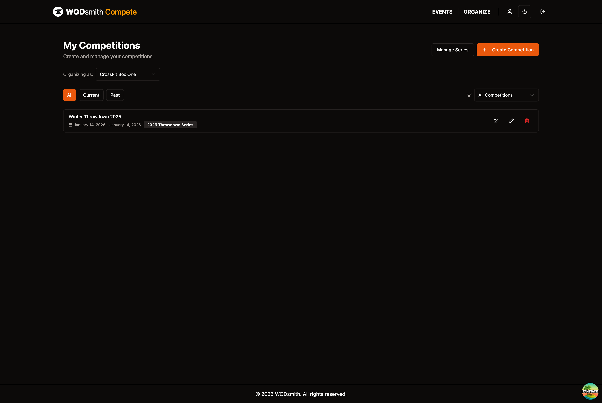
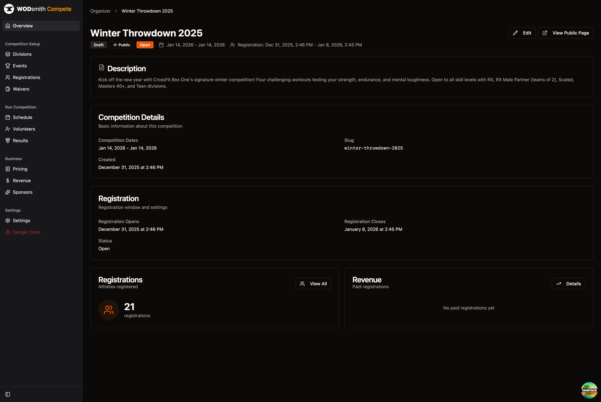
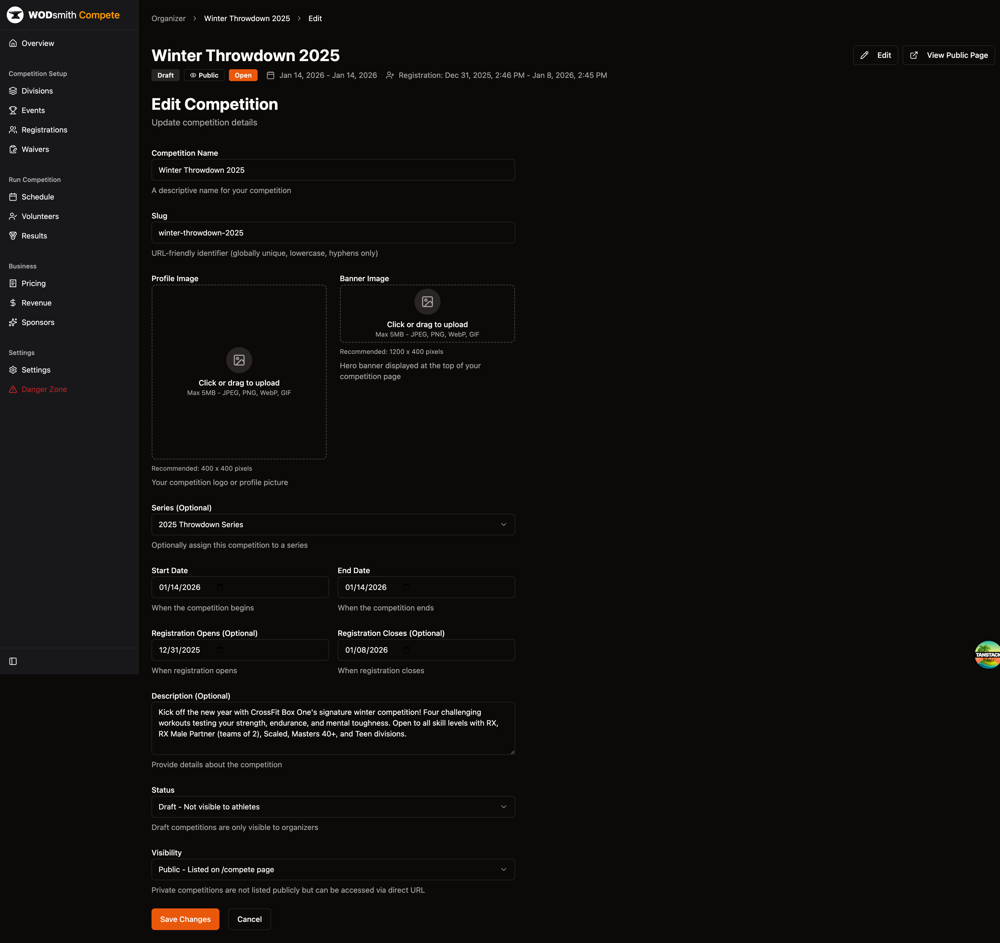
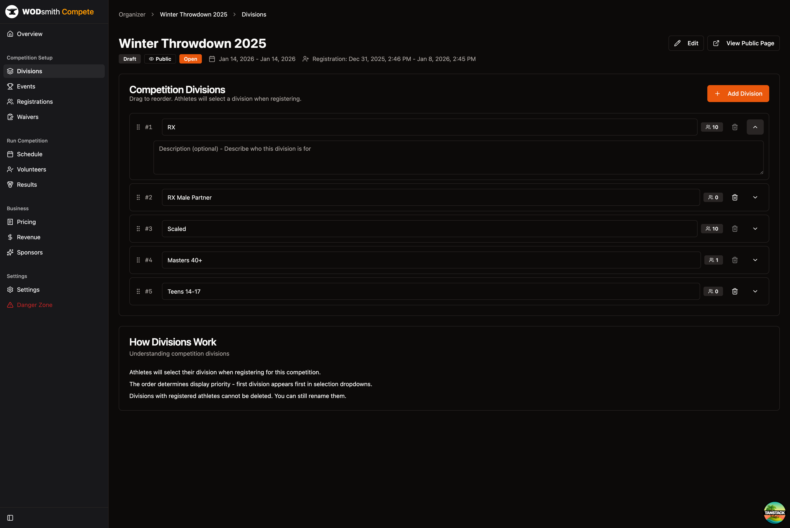
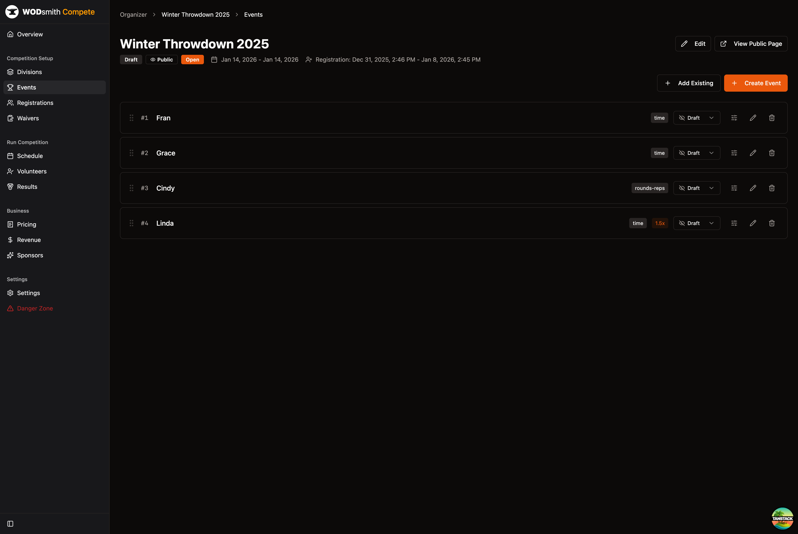
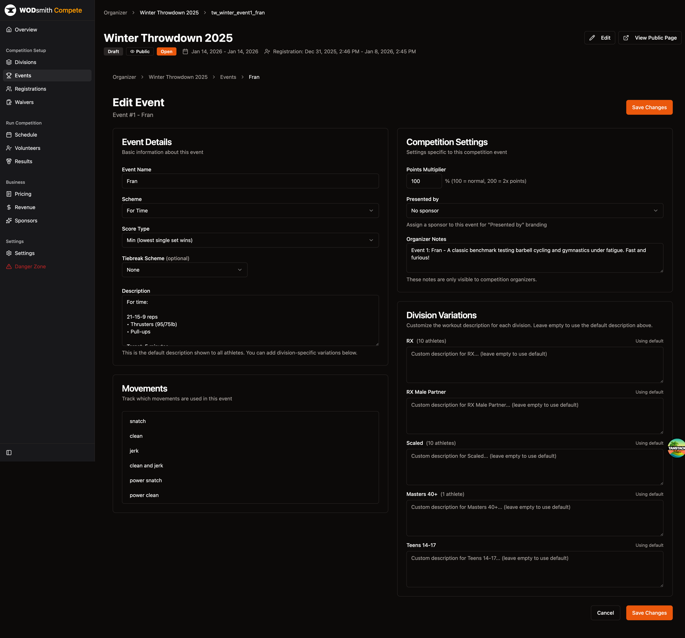
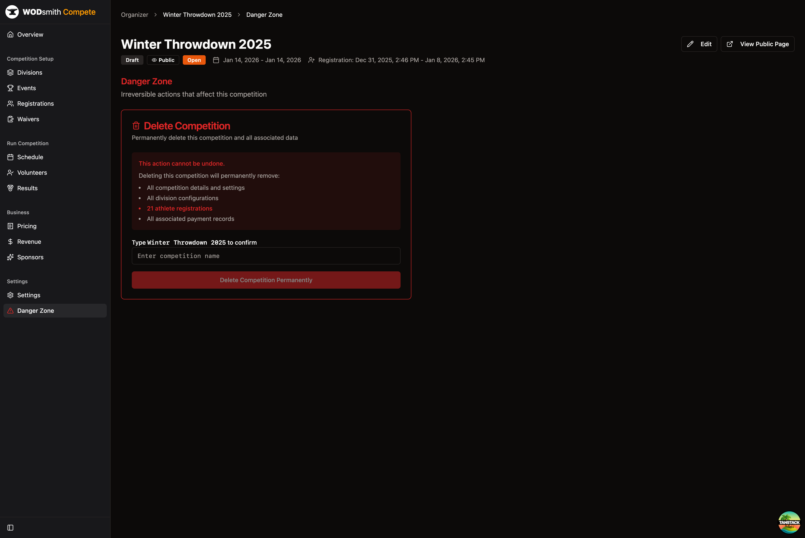

# How to Edit Competition Settings

Modify competition details, divisions, and configuration after creation.

## Prerequisites

- Competition organizer permissions for the team hosting the competition

## Accessing Competition Management

1. Navigate to **COMPETE** → **ORGANIZE**
2. Find your competition and click **Manage**

3. You'll see the competition overview dashboard

## Editing Basic Information

1. From the competition overview, click the **Edit** button
2. Update any of these fields:
   - Competition name
   - Slug (URL identifier)
   - Profile image and banner image
   - Series assignment
   - Start and end dates
   - Registration open/close dates
   - Description
   - Status (Draft or Published)
   - Visibility (Public or Private)
3. Click **Save Changes**

<!-- FEATURE NOT FOUND: Location field - there is no dedicated location/venue field in the edit form. Consider adding location details to the Description field. -->

<!-- FEATURE NOT FOUND: Time fields - only dates are editable, not specific start/end times. -->

## Modifying Divisions

### Adding a Division

1. Go to **Divisions** in the sidebar
2. Click **Add Division**
3. Enter the division name
4. Optionally expand the row to add a description

### Editing a Division

1. Click directly on the division name to edit inline
2. Click the expand arrow to edit the description
3. Changes save automatically

:::tip
You can drag divisions to reorder them. The order determines how they appear in registration dropdowns.
:::

:::caution
Divisions with registered athletes cannot be deleted. You can still rename them or update their descriptions.
:::

<!-- FEATURE NOT FOUND: Division cap/limit - there is no field to set a maximum number of athletes per division. -->

## Updating Events

### Adding Events

1. Go to **Events** in the sidebar
2. Click **Create Event** for a new workout, or **Add Existing** to link an existing workout
3. Configure the event details
4. Click **Save Changes**

### Editing Events

1. Click the link icon next to an event to open the edit page
2. Modify:
   - Event name
   - Scheme (For Time, AMRAP, etc.)
   - Score type
   - Tiebreak scheme
   - Description
   - Movements used
   - Points multiplier
   - Sponsor assignment
   - Organizer notes
   - Division-specific variations
3. Click **Save Changes**

<!-- FEATURE NOT FOUND: Explicit time cap field - time cap information should be included in the workout description. -->

## Registration Settings

Registration settings are managed across multiple pages:

### Registration Dates

1. Click **Edit** from the competition overview
2. Update **Registration Opens** and **Registration Closes** dates
3. Click **Save Changes**

### Entry Fees (Pricing)

1. Go to **Pricing** in the sidebar under Business
2. Connect your Stripe account if not already connected
3. Set registration fees per division

:::note
Free registrations ($0) work without a Stripe connection. Paid registrations require Stripe setup.
:::

### Waiver Requirements

1. Go to **Waivers** in the sidebar under Competition Setup
2. Click **Add Waiver** to create liability agreements
3. Athletes must accept waivers during registration

<!-- FEATURE NOT FOUND: Custom questions - there is no feature to add custom registration questions. -->

## Changing Competition Status

To control whether athletes can see your competition:

1. Click **Edit** from the competition overview
2. Change the **Status** dropdown:
   - **Draft** - Only visible to organizers
   - **Published** - Visible to athletes
3. Change the **Visibility** dropdown:
   - **Public** - Listed on the /compete page
   - **Private** - Accessible only via direct URL
4. Click **Save Changes**

:::tip
Use Draft status while setting up your competition. Switch to Published when ready for registrations.
:::

## Competition Settings

The **Settings** page in the sidebar contains operational settings:

- **Default Heats Per Rotation** - How many heats judges work before rotating
- **Default Lane Shift Pattern** - How judges move between lanes

## Danger Zone

The **Danger Zone** page allows permanent deletion of a competition.

:::danger
Deleting a competition permanently removes all data including registrations and payment records. This action cannot be undone.
:::

---

*See also: [Competition Settings Reference](/reference/competition-settings)*
