# TheWodApp - Complete Route Structure Analysis

This diagram shows the complete route structure of TheWodApp, a SaaS workout management platform built with Next.js App Router.

```mermaid
graph TD
    Root["/"] --> Marketing["(marketing)"]
    Root --> Main["(main)"]
    Root --> Auth["(auth)"]
    Root --> Admin["(admin)"]
    Root --> Dashboard["(dashboard)"]
    Root --> Settings["(settings)"]
    Root --> Legal["(legal)"]
    Root --> API["api/"]

    %% Marketing Routes
    Marketing --> MarketingHome["/"]

    %% Main Application Routes
    Main --> Teams["/teams"]
    Main --> Programming["/programming"]
    Main --> Workouts["/workouts"]
    Main --> Movements["/movements"]
    Main --> Log["/log"]
    Main --> Calculator["/calculator"]

    %% Teams Routes
    Teams --> TeamsIndex["/teams - Team list with scheduled workouts"]

    %% Programming Routes
    Programming --> ProgrammingIndex["/programming - Public programming tracks"]
    Programming --> ProgrammingTrack["/programming/[trackId] - Track details"]

    %% Workouts Routes
    Workouts --> WorkoutsIndex["/workouts - User workouts list"]
    Workouts --> WorkoutNew["/workouts/new - Create workout"]
    Workouts --> WorkoutDetail["/workouts/[id] - Workout details"]
    Workouts --> WorkoutEdit["/workouts/[id]/edit - Edit workout"]

    %% Movements Routes
    Movements --> MovementsIndex["/movements - Movement list"]
    Movements --> MovementNew["/movements/new - Create movement"]
    Movements --> MovementDetail["/movements/[id] - Movement details"]

    %% Log Routes
    Log --> LogIndex["/log - Workout log with calendar"]
    Log --> LogNew["/log/new - Log new result"]

    %% Calculator Routes
    Calculator --> CalculatorIndex["/calculator - Barbell calculator"]
    Calculator --> CalculatorSpreadsheet["/calculator/spreadsheet - Percentage calculator"]

    %% Authentication Routes
    Auth --> SignIn["/sign-in"]
    Auth --> SignUp["/sign-up"]
    Auth --> ForgotPassword["/forgot-password"]
    Auth --> ResetPassword["/reset-password"]
    Auth --> VerifyEmail["/verify-email"]
    Auth --> TeamInvite["/team-invite"]
    Auth --> SSO["/sso"]

    %% SSO Routes
    SSO --> GoogleSSO["/sso/google"]
    SSO --> GoogleCallback["/sso/google/callback"]

    %% Admin Routes
    Admin --> AdminHome["/admin - Admin dashboard"]
    Admin --> AdminTeams["/admin/teams"]
    Admin --> AdminTeamDetail["/admin/teams/[teamId]"]
    Admin --> AdminProgramming["/admin/teams/[teamId]/programming"]
    Admin --> AdminTrack["/admin/teams/[teamId]/programming/[trackId]"]

    %% Dashboard Routes
    Dashboard --> DashboardHome["/dashboard - Main dashboard"]
    Dashboard --> DashboardBilling["/dashboard/billing"]
    Dashboard --> DashboardMarketplace["/dashboard/marketplace"]

    %% Settings Routes
    Settings --> SettingsRedirect["/settings → /settings/profile"]
    Settings --> SettingsProfile["/settings/profile"]
    Settings --> SettingsSecurity["/settings/security"]
    Settings --> SettingsSessions["/settings/sessions"]
    Settings --> SettingsTeams["/settings/teams"]
    Settings --> SettingsTeamDetail["/settings/teams/[teamSlug]"]
    Settings --> SettingsTeamCreate["/settings/teams/create"]
    Settings --> SettingsCatchAll["/settings/[...segment]"]

    %% Legal Routes
    Legal --> Privacy["/privacy"]
    Legal --> Terms["/terms"]

    %% API Routes
    API --> GetSession["/api/get-session"]
    API --> OpenGraph["/api/og"]

    %% Styling for different route groups
    classDef marketing fill:#e1f5fe
    classDef main fill:#f3e5f5
    classDef auth fill:#fff3e0
    classDef admin fill:#ffebee
    classDef dashboard fill:#e8f5e8
    classDef settings fill:#f9f9f9
    classDef legal fill:#fce4ec
    classDef api fill:#e0f2f1

    class Marketing,MarketingHome marketing
    class Main,Teams,Programming,Workouts,Movements,Log,Calculator,TeamsIndex,ProgrammingIndex,ProgrammingTrack,WorkoutsIndex,WorkoutNew,WorkoutDetail,WorkoutEdit,MovementsIndex,MovementNew,MovementDetail,LogIndex,LogNew,CalculatorIndex,CalculatorSpreadsheet main
    class Auth,SignIn,SignUp,ForgotPassword,ResetPassword,VerifyEmail,TeamInvite,SSO,GoogleSSO,GoogleCallback auth
    class Admin,AdminHome,AdminTeams,AdminTeamDetail,AdminProgramming,AdminTrack admin
    class Dashboard,DashboardHome,DashboardBilling,DashboardMarketplace dashboard
    class Settings,SettingsRedirect,SettingsProfile,SettingsSecurity,SettingsSessions,SettingsTeams,SettingsTeamDetail,SettingsTeamCreate,SettingsCatchAll settings
    class Legal,Privacy,Terms legal
    class API,GetSession,OpenGraph api
```

## Route Group Analysis

### 1. **(marketing)** - Public Marketing Pages
- **Authentication**: None required
- **Purpose**: Landing page, features, pricing
- **Layout**: Marketing-focused layout with hero, features, and pricing sections

### 2. **(main)** - Core Application Features
- **Authentication**: Required for most routes
- **Purpose**: Main workout management functionality
- **Key Features**:
  - Team management and scheduling
  - Workout programming and tracking
  - Movement library
  - Personal workout logging
  - Barbell/percentage calculators

### 3. **(auth)** - Authentication & User Management
- **Authentication**: Mixed (sign-in/up pages don't require auth)
- **Purpose**: User authentication flow
- **Features**:
  - Sign in/up with email and SSO
  - Password reset and email verification
  - Team invitation handling

### 4. **(admin)** - Administrative Interface
- **Authentication**: Admin privileges required
- **Purpose**: Platform administration
- **Features**:
  - Team management
  - Programming track administration
  - Workout scheduling for teams

### 5. **(dashboard)** - User Dashboard
- **Authentication**: Required
- **Purpose**: Personal dashboard and account management
- **Features**:
  - Billing and subscription management
  - Marketplace for components/features

### 6. **(settings)** - User Settings
- **Authentication**: Required
- **Purpose**: Account and team settings
- **Features**:
  - Profile management
  - Security settings (including passkeys)
  - Session management
  - Team settings and creation

### 7. **(legal)** - Legal Pages
- **Authentication**: None required
- **Purpose**: Legal compliance
- **Features**: Privacy policy and terms of service

### 8. **api/** - API Endpoints
- **Authentication**: Varies by endpoint
- **Purpose**: Backend API services
- **Features**:
  - Session management
  - Open Graph image generation

## Key Architectural Patterns

1. **Route Groups**: Uses Next.js route groups to organize related functionality
2. **Dynamic Routes**: Extensive use of `[id]` and `[teamId]` for entity-specific pages
3. **Catch-All Routes**: Settings uses `[...segment]` for flexible routing
4. **Nested Layouts**: Each route group has its own layout for consistent UI
5. **Multi-tenancy**: Team-based routing in admin and settings sections
6. **Authentication Boundaries**: Clear separation between public and protected routes