# Database Entity Relationship Diagram

This ERD represents the complete database schema for the WOD application, including user management, team management, programming tracks, workouts, and results tracking.

```mermaid
erDiagram
    %% Core User and Authentication Tables
    user {
        string id PK
        string firstName
        string lastName
        string email UK
        string passwordHash
        string role
        timestamp emailVerified
        string signUpIpAddress
        string googleAccountId
        string avatar
        integer currentCredits
        timestamp lastCreditRefreshAt
        timestamp createdAt
        timestamp updatedAt
        integer updateCounter
    }

    passkey_credential {
        string id PK
        string userId FK
        string credentialId UK
        string credentialPublicKey
        integer counter
        string transports
        string aaguid
        string userAgent
        string ipAddress
        timestamp createdAt
        timestamp updatedAt
        integer updateCounter
    }

    %% Credit System Tables
    credit_transaction {
        string id PK
        string userId FK
        integer amount
        integer remainingAmount
        string type
        string description
        timestamp expirationDate
        timestamp expirationDateProcessedAt
        string paymentIntentId
        timestamp createdAt
        timestamp updatedAt
        integer updateCounter
    }

    purchased_item {
        string id PK
        string userId FK
        string itemType
        string itemId
        timestamp purchasedAt
        timestamp createdAt
        timestamp updatedAt
        integer updateCounter
    }

    %% Team Management Tables
    team {
        string id PK
        string name
        string slug UK
        string description
        string avatarUrl
        string settings
        string billingEmail
        string planId
        timestamp planExpiresAt
        integer creditBalance
        string defaultTrackId FK
        timestamp createdAt
        timestamp updatedAt
        integer updateCounter
    }

    team_membership {
        string id PK
        string teamId FK
        string userId FK
        string roleId
        integer isSystemRole
        string invitedBy FK
        timestamp invitedAt
        timestamp joinedAt
        timestamp expiresAt
        integer isActive
        timestamp createdAt
        timestamp updatedAt
        integer updateCounter
    }

    team_role {
        string id PK
        string teamId FK
        string name
        string description
        json permissions
        string metadata
        integer isEditable
        timestamp createdAt
        timestamp updatedAt
        integer updateCounter
    }

    team_invitation {
        string id PK
        string teamId FK
        string email
        string roleId
        integer isSystemRole
        string token UK
        string invitedBy FK
        timestamp expiresAt
        timestamp acceptedAt
        string acceptedBy FK
        timestamp createdAt
        timestamp updatedAt
        integer updateCounter
    }

    %% Programming Tracks and Scheduling
    programming_track {
        string id PK
        string name
        string description
        string type
        string ownerTeamId FK
        integer isPublic
        string pricingType
        integer price
        string currency
        string billingInterval
        string stripePriceId
        string stripeProductId
        integer trialPeriodDays
        timestamp createdAt
        timestamp updatedAt
        integer updateCounter
    }

    team_programming_track {
        string teamId FK
        string trackId FK
        integer isActive
        timestamp addedAt
        timestamp createdAt
        timestamp updatedAt
        integer updateCounter
    }

    user_programming_track {
        string userId FK
        string trackId FK
        integer isActive
        timestamp subscribedAt
        integer startDayOffset
        string paymentStatus
        string stripeCustomerId
        string stripeSubscriptionId
        string stripePaymentIntentId
        timestamp subscriptionExpiresAt
        timestamp cancelledAt
        integer cancelAtPeriodEnd
        timestamp createdAt
        timestamp updatedAt
        integer updateCounter
    }

    track_workout {
        string id PK
        string trackId FK
        string workoutId FK
        integer dayNumber
        integer weekNumber
        string notes
        timestamp createdAt
        timestamp updatedAt
        integer updateCounter
    }

    scheduled_workout_instance {
        string id PK
        string teamId FK
        string trackWorkoutId FK
        timestamp scheduledDate
        string teamSpecificNotes
        string scalingGuidanceForDay
        string classTimes
        timestamp createdAt
        timestamp updatedAt
        integer updateCounter
    }

    user_scheduled_workout_instance {
        string id PK
        string userId FK
        string trackWorkoutId FK
        timestamp scheduledDate
        string userSpecificNotes
        string scalingGuidanceForUser
        integer isCompleted
        timestamp completedAt
        timestamp createdAt
        timestamp updatedAt
        integer updateCounter
    }

    programming_track_payment {
        string id PK
        string userId FK
        string trackId FK
        integer amount
        string currency
        string paymentType
        string status
        string stripePaymentIntentId
        string stripeSubscriptionId
        string stripeInvoiceId
        string stripeCustomerId
        string failureReason
        timestamp refundedAt
        integer refundAmount
        timestamp periodStart
        timestamp periodEnd
        timestamp createdAt
        timestamp updatedAt
        integer updateCounter
    }

    %% Workout and Movement Tables
    workouts {
        string id PK
        string name
        string description
        string scope
        string scheme
        integer repsPerRound
        integer roundsToScore
        string userId FK
        string sugarId
        string tiebreakScheme
        string secondaryScheme
        string sourceTrackId FK
        timestamp createdAt
        timestamp updatedAt
        integer updateCounter
    }

    movements {
        string id PK
        string name
        string type
        timestamp createdAt
        timestamp updatedAt
        integer updateCounter
    }

    workout_movements {
        string id PK
        string workoutId FK
        string movementId FK
        timestamp createdAt
        timestamp updatedAt
        integer updateCounter
    }

    %% Tags System
    spicy_tags {
        string id PK
        string name UK
        timestamp createdAt
        timestamp updatedAt
        integer updateCounter
    }

    workout_tags {
        string id PK
        string workoutId FK
        string tagId FK
        timestamp createdAt
        timestamp updatedAt
        integer updateCounter
    }

    %% Results and Performance Tracking
    results {
        string id PK
        string userId FK
        timestamp date
        string workoutId FK
        string type
        string notes
        string programmingTrackId FK
        string scheduledWorkoutInstanceId FK
        string userScheduledWorkoutInstanceId FK
        string scale
        string wodScore
        integer setCount
        integer distance
        integer time
        timestamp createdAt
        timestamp updatedAt
        integer updateCounter
    }

    sets {
        string id PK
        string resultId FK
        integer setNumber
        string notes
        integer reps
        integer weight
        string status
        integer distance
        integer time
        integer score
        timestamp createdAt
        timestamp updatedAt
        integer updateCounter
    }

    %% Relationships - User Authentication
    user ||--o{ passkey_credential : "has"
    user ||--o{ credit_transaction : "owns"
    user ||--o{ purchased_item : "purchases"

    %% Relationships - Team Management
    user ||--o{ team_membership : "member"
    user ||--o{ team_membership : "inviter"
    user ||--o{ team_invitation : "invites"
    user ||--o{ team_invitation : "accepts"
    team ||--o{ team_membership : "has"
    team ||--o{ team_role : "defines"
    team ||--o{ team_invitation : "creates"

    %% Relationships - Programming Tracks
    team ||--o{ programming_track : "owns"
    team ||--o{ team_programming_track : "subscribes_to"
    user ||--o{ user_programming_track : "subscribes_to"
    user ||--o{ programming_track_payment : "pays_for"
    programming_track ||--o{ team_programming_track : "subscribed_by_teams"
    programming_track ||--o{ user_programming_track : "subscribed_by_users"
    programming_track ||--o{ programming_track_payment : "paid_for"
    programming_track ||--o{ track_workout : "contains"
    programming_track ||--|| team : "default_track"

    %% Relationships - Workouts and Scheduling
    workouts ||--o{ track_workout : "included_in"
    workouts ||--o{ workout_movements : "contains"
    workouts ||--o{ workout_tags : "tagged_with"
    movements ||--o{ workout_movements : "used_in"
    spicy_tags ||--o{ workout_tags : "tags"
    track_workout ||--o{ scheduled_workout_instance : "scheduled_for_team"
    track_workout ||--o{ user_scheduled_workout_instance : "scheduled_for_user"
    team ||--o{ scheduled_workout_instance : "schedules"
    user ||--o{ user_scheduled_workout_instance : "schedules"
    programming_track ||--o{ workouts : "source_track"

    %% Relationships - Results and Performance
    user ||--o{ results : "records"
    user ||--o{ workouts : "creates"
    workouts ||--o{ results : "performed_as"
    programming_track ||--o{ results : "tracks_progress"
    scheduled_workout_instance ||--o{ results : "completed_as"
    user_scheduled_workout_instance ||--o{ results : "completed_as"
    results ||--o{ sets : "contains"
```

## Key Schema Features

### Multi-Tenancy Support
- **Teams**: Organizations that can have multiple members with different roles
- **Team Roles**: Custom roles with granular permissions stored as JSON arrays
- **Team Memberships**: User associations with teams including role assignments
- **Team Invitations**: Token-based email invitation system with role pre-assignment

### Programming Track System
- **Programming Tracks**: Structured workout programs with three types and flexible pricing:
  - `self_programmed`: Individual user-created tracks
  - `team_owned`: Team-created tracks for their members
  - `official_3rd_party`: Public tracks from fitness organizations
- **Flexible Pricing**: Support for free, one-time payment, and recurring subscription models
- **Stripe Integration**: Full integration with Stripe for payment processing, including product and price IDs
- **Trial Periods**: Support for trial periods on recurring subscriptions
- **Dual Subscription Model**: Both teams and individual users can subscribe to tracks
- **Track Workouts**: Workouts organized by day/week within tracks with optional notes
- **Payment Tracking**: Comprehensive payment history with status tracking and refund support

### User Management & Authentication
- **Multi-Factor Authentication**: Support for both password-based and WebAuthn/FIDO2 passkeys
- **Credit System**: User credits with transaction tracking, expiration dates, and automated refresh
- **Purchased Items**: Track user purchases with different item types for marketplace features
- **Profile Management**: Comprehensive user profiles with avatar support and OAuth integration

### Workout System
- **Flexible Workouts**: Support for 11 different workout schemes including time-based, rep-based, EMOM, and distance-based
- **Movement Library**: Categorized movements (weightlifting, gymnastic, monostructural)
- **Tagging System**: Flexible workout categorization with many-to-many relationships
- **Source Tracking**: Workouts can reference their originating programming track

### Scheduling and Completion
- **Team Scheduling**: Team-wide workout scheduling with class times and team-specific scaling guidance
- **Individual Scheduling**: Personal workout scheduling from subscribed tracks with completion tracking
- **Progress Tracking**: Comprehensive completion status with timestamps
- **Flexible Start Points**: Users can start tracks from custom day offsets to accommodate different schedules

### Results and Performance Tracking
- **Unified Results System**: Single table handling WOD, strength, and monostructural results
- **Flexible Scoring**: Support for time, reps, weight, distance, and custom scoring schemes
- **Set-Level Detail**: Individual set tracking with various metrics (reps, weight, time, distance, etc.)
- **Multiple Result Sources**: Results can be linked to either team or individual scheduled workouts
- **Programming Track Analytics**: Results connected to programming tracks for progress analysis

### Data Integrity & Performance
- **Audit Trail**: All tables include `createdAt`, `updatedAt`, and `updateCounter` for change tracking
- **Optimized Indexing**: Strategic indexes on frequently queried fields and foreign keys
- **Soft Deletes**: Using `isActive` flags where appropriate to maintain data integrity
- **Composite Keys**: Efficient junction tables for many-to-many relationships

This schema supports both individual fitness tracking and comprehensive team/gym management use cases, with robust programming track functionality for structured workout delivery and progress tracking.
