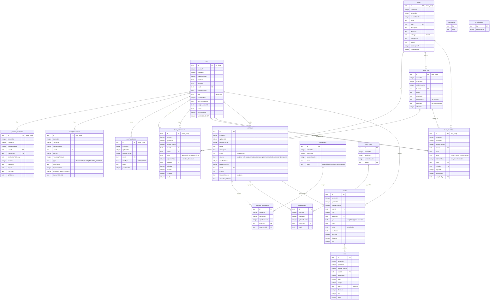

# Database Entity Relationship Diagram

This diagram shows the complete database schema for the application, including user management, multi-tenancy, billing, and workout tracking systems.

## Key Features

### User Management

- **Users**: Core user accounts with authentication and profile data
- **Passkey Credentials**: WebAuthn/FIDO2 passwordless authentication
- **Google SSO**: OAuth integration for Google sign-in

### Multi-Tenancy

- **Teams**: Primary organizational units with billing and settings
- **Team Memberships**: User-team relationships with roles
- **Team Roles**: Custom roles with granular permissions
- **Team Invitations**: Email-based invitation system

### Billing & Credits

- **Credit Transactions**: Track credit purchases, usage, and refreshes
- **Purchased Items**: Track component and feature purchases

### Workout Tracking

- **Workouts**: Exercise routines with various scoring schemes
- **Movements**: Exercise types (weightlifting, gymnastic, monostructural)
- **Tags**: Categorization system for workouts
- **Results**: User performance records
- **Sets**: Individual set data within results

### System Features

- **Audit Trail**: All tables include `createdAt`, `updatedAt`, and `updateCounter`
- **Soft Deletes**: Using `isActive` flags where appropriate
- **Flexible Permissions**: JSON-based permission system for teams
- **Caching**: OpenNext cache tables for performance optimization
