# Database Schema UML Diagram

This diagram represents the complete database schema for TheWODApp, showing all tables and their relationships across different functional areas.

```mermaid
erDiagram
    %% USER & AUTHENTICATION
    user {
        text id PK "usr_*"
        text firstName
        text lastName
        text email UK
        text passwordHash
        text role "admin|user"
        integer emailVerified
        text signUpIpAddress
        text googleAccountId UK
        text avatar
        integer currentCredits
        integer lastCreditRefreshAt
        integer createdAt
        integer updatedAt
        integer updateCounter
    }

    passkey_credential {
        text id PK "pkey_*"
        text userId FK
        text credentialId UK
        text credentialPublicKey
        integer counter
        text transports
        text aaguid
        text userAgent
        text ipAddress
        integer createdAt
        integer updatedAt
        integer updateCounter
    }

    %% TEAMS & PERMISSIONS
    team {
        text id PK "team_*"
        text name
        text slug UK
        text description
        text avatarUrl
        text settings "JSON"
        text billingEmail
        text planId
        integer planExpiresAt
        integer creditBalance
        text defaultTrackId
        text defaultScalingGroupId
        integer isPersonalTeam
        text personalTeamOwnerId FK
        integer createdAt
        integer updatedAt
        integer updateCounter
    }

    team_membership {
        text id PK "tmem_*"
        text teamId FK
        text userId FK
        text roleId
        integer isSystemRole
        text invitedBy FK
        integer invitedAt
        integer joinedAt
        integer expiresAt
        integer isActive
        integer createdAt
        integer updatedAt
        integer updateCounter
    }

    team_role {
        text id PK "trole_*"
        text teamId FK
        text name
        text description
        text permissions "JSON Array"
        text metadata "JSON"
        integer isEditable
        integer createdAt
        integer updatedAt
        integer updateCounter
    }

    team_invitation {
        text id PK "tinv_*"
        text teamId FK
        text email
        text roleId
        integer isSystemRole
        text token UK
        text invitedBy FK
        integer expiresAt
        integer acceptedAt
        text acceptedBy FK
        integer createdAt
        integer updatedAt
        integer updateCounter
    }

    %% BILLING & CREDITS
    credit_transaction {
        text id PK "ctxn_*"
        text userId FK
        integer amount
        integer remainingAmount
        text type "PURCHASE|USAGE|MONTHLY_REFRESH"
        text description
        integer expirationDate
        integer expirationDateProcessedAt
        text paymentIntentId
        integer createdAt
        integer updatedAt
        integer updateCounter
    }

    purchased_item {
        text id PK "pitem_*"
        text userId FK
        text itemType "COMPONENT"
        text itemId
        integer purchasedAt
        integer createdAt
        integer updatedAt
        integer updateCounter
    }

    %% WORKOUTS & MOVEMENTS
    movements {
        text id PK
        text name
        text type "weightlifting|gymnastic|monostructural"
        integer createdAt
        integer updatedAt
        integer updateCounter
    }

    spicy_tags {
        text id PK
        text name UK
        integer createdAt
        integer updatedAt
        integer updateCounter
    }

    workouts {
        text id PK
        text name
        text description
        text scope "private|public"
        text scheme "time|time-with-cap|pass-fail|rounds-reps|reps|emom|load|calories|meters|feet|points"
        integer repsPerRound
        integer roundsToScore
        text teamId FK
        text sugarId
        text tiebreakScheme "time|reps"
        text secondaryScheme
        text sourceTrackId FK
        text sourceWorkoutId FK
        text scalingGroupId
        integer createdAt
        integer updatedAt
        integer updateCounter
    }

    workout_tags {
        text id PK
        text workoutId FK
        text tagId FK
        integer createdAt
        integer updatedAt
        integer updateCounter
    }

    workout_movements {
        text id PK
        text workoutId FK
        text movementId FK
        integer createdAt
        integer updatedAt
        integer updateCounter
    }

    %% RESULTS & SETS
    results {
        text id PK
        text userId FK
        integer date
        text workoutId FK
        text type "wod|strength|monostructural"
        text notes
        text programmingTrackId
        text scheduledWorkoutInstanceId
        text scale "rx|scaled|rx+"
        text scalingLevelId FK
        integer asRx
        text wodScore
        integer setCount
        integer distance
        integer time
        integer createdAt
        integer updatedAt
        integer updateCounter
    }

    sets {
        text id PK
        text resultId FK
        integer setNumber
        text notes
        integer reps
        integer weight
        text status "pass|fail"
        integer distance
        integer time
        integer score
        integer createdAt
        integer updatedAt
        integer updateCounter
    }

    %% PROGRAMMING & TRACKING
    programming_track {
        text id PK "ptrk_*"
        text name
        text description
        text type "self_programmed|team_owned|official_3rd_party"
        text ownerTeamId FK
        text scalingGroupId
        integer isPublic
        integer createdAt
        integer updatedAt
        integer updateCounter
    }

    team_programming_track {
        text teamId FK
        text trackId FK
        integer isActive
        integer subscribedAt
        integer startDayOffset
        integer createdAt
        integer updatedAt
        integer updateCounter
    }

    track_workout {
        text id PK "trwk_*"
        text trackId FK
        text workoutId FK
        integer dayNumber
        integer weekNumber
        text notes
        integer createdAt
        integer updatedAt
        integer updateCounter
    }

    scheduled_workout_instance {
        text id PK "swi_*"
        text teamId FK
        text trackWorkoutId FK
        text workoutId FK
        integer scheduledDate
        text teamSpecificNotes
        text scalingGuidanceForDay
        text classTimes "JSON"
        integer createdAt
        integer updatedAt
        integer updateCounter
    }

    %% SCALING SYSTEM
    scaling_groups {
        text id PK "sgrp_*"
        text title
        text description
        text teamId FK
        integer isDefault
        integer isSystem
        integer createdAt
        integer updatedAt
        integer updateCounter
    }

    scaling_levels {
        text id PK "slvl_*"
        text scalingGroupId FK
        text label
        integer position
        integer createdAt
        integer updatedAt
        integer updateCounter
    }

    workout_scaling_descriptions {
        text id PK "wsd_*"
        text workoutId FK
        text scalingLevelId FK
        text description
        integer createdAt
        integer updatedAt
        integer updateCounter
    }

    %% SCHEDULING SYSTEM
    coaches {
        text id PK
        text userId FK
        text teamId FK
        integer weeklyClassLimit
        text schedulingPreference "morning|afternoon|night|any"
        text schedulingNotes
        integer isActive
        integer createdAt
        integer updatedAt
        integer updateCounter
    }

    locations {
        text id PK
        text teamId FK
        text name
        integer capacity
        integer createdAt
        integer updatedAt
        integer updateCounter
    }

    class_catalog {
        text id PK
        text teamId FK
        text name
        text description
        integer durationMinutes
        integer maxParticipants
        integer createdAt
        integer updatedAt
        integer updateCounter
    }

    skills {
        text id PK
        text teamId FK
        text name
        integer createdAt
        integer updatedAt
        integer updateCounter
    }

    class_catalog_to_skills {
        text classCatalogId FK
        text skillId FK
    }

    coach_to_skills {
        text coachId FK
        text skillId FK
    }

    coach_blackout_dates {
        text id PK
        text coachId FK
        integer startDate
        integer endDate
        text reason
        integer createdAt
        integer updatedAt
        integer updateCounter
    }

    coach_recurring_unavailability {
        text id PK
        text coachId FK
        integer dayOfWeek
        text startTime
        text endTime
        text description
        integer createdAt
        integer updatedAt
        integer updateCounter
    }

    schedule_templates {
        text id PK
        text teamId FK
        text name
        text classCatalogId FK
        text locationId FK
        integer createdAt
        integer updatedAt
        integer updateCounter
    }

    schedule_template_classes {
        text id PK
        text templateId FK
        integer dayOfWeek
        text startTime
        text endTime
        integer requiredCoaches
        integer createdAt
        integer updatedAt
        integer updateCounter
    }

    schedule_template_class_required_skills {
        text templateClassId FK
        text skillId FK
    }

    generated_schedules {
        text id PK
        text teamId FK
        text locationId FK
        integer weekStartDate
        integer createdAt
        integer updatedAt
        integer updateCounter
    }

    scheduled_classes {
        text id PK
        text scheduleId FK
        text coachId FK
        text classCatalogId FK
        text locationId FK
        integer startTime
        integer endTime
        integer createdAt
        integer updatedAt
        integer updateCounter
    }

    %% CORE RELATIONSHIPS
    user ||--o{ passkey_credential : "has"
    user ||--o{ team_membership : "member of"
    user ||--o{ credit_transaction : "transactions"
    user ||--o{ purchased_item : "purchases"
    user ||--o{ results : "logs"
    user ||--o{ coaches : "coaches"
    user ||--o| team : "owns personal team"

    team ||--o{ team_membership : "members"
    team ||--o{ team_role : "custom roles"
    team ||--o{ team_invitation : "invitations"
    team ||--o{ workouts : "owns"
    team ||--o{ programming_track : "owns"
    team ||--o{ team_programming_track : "subscribed to"
    team ||--o{ scheduled_workout_instance : "schedules"
    team ||--o{ scaling_groups : "scaling groups"
    team ||--o{ locations : "locations"
    team ||--o{ class_catalog : "class types"
    team ||--o{ skills : "skills"
    team ||--o{ schedule_templates : "schedule templates"
    team ||--o{ generated_schedules : "generated schedules"

    %% WORKOUT RELATIONSHIPS
    workouts ||--o{ workout_tags : "tagged with"
    workouts ||--o{ workout_movements : "contains"
    workouts ||--o{ results : "logged as"
    workouts ||--o{ track_workout : "in tracks"
    workouts ||--o{ workout_scaling_descriptions : "scaling info"
    workouts ||--o| workouts : "remixed from"
    spicy_tags ||--o{ workout_tags : "used in"
    movements ||--o{ workout_movements : "used in"

    %% PROGRAMMING RELATIONSHIPS
    programming_track ||--o{ team_programming_track : "subscriptions"
    programming_track ||--o{ track_workout : "contains"
    track_workout ||--o{ scheduled_workout_instance : "scheduled as"

    %% RESULTS RELATIONSHIPS
    results ||--o{ sets : "composed of"

    %% SCALING RELATIONSHIPS
    scaling_groups ||--o{ scaling_levels : "has levels"
    scaling_levels ||--o{ workout_scaling_descriptions : "descriptions"

    %% SCHEDULING RELATIONSHIPS
    coaches ||--o{ coach_to_skills : "skilled in"
    coaches ||--o{ coach_blackout_dates : "unavailable"
    coaches ||--o{ coach_recurring_unavailability : "recurring unavailable"
    coaches ||--o{ scheduled_classes : "assigned to"

    skills ||--o{ coach_to_skills : "coaches have"
    skills ||--o{ class_catalog_to_skills : "required for classes"
    skills ||--o{ schedule_template_class_required_skills : "template requirements"

    class_catalog ||--o{ class_catalog_to_skills : "requires skills"
    class_catalog ||--o{ schedule_templates : "used in templates"
    class_catalog ||--o{ scheduled_classes : "scheduled as"

    locations ||--o{ schedule_templates : "template location"
    locations ||--o{ generated_schedules : "schedule location"
    locations ||--o{ scheduled_classes : "class location"

    schedule_templates ||--o{ schedule_template_classes : "template classes"
    schedule_template_classes ||--o{ schedule_template_class_required_skills : "skill requirements"

    generated_schedules ||--o{ scheduled_classes : "contains classes"
```

## Schema Overview

### Core Modules

1. **User & Authentication**: User accounts with passkey support
2. **Teams & Permissions**: Multi-tenant team system with role-based access
3. **Billing & Credits**: Credit-based billing with transaction tracking
4. **Workouts & Movements**: Core workout data with movements and tagging
5. **Results & Sets**: Workout logging with detailed set tracking
6. **Programming & Tracking**: Programming tracks with scheduled instances
7. **Scaling System**: Flexible workout scaling with groups and levels
8. **Scheduling System**: Coach scheduling with skills and availability

### Key Design Patterns

- **Multi-tenancy**: All major entities are scoped to teams via `teamId`
- **Flexible Scaling**: Workout scaling through groups and levels rather than fixed categories
- **Programming Tracks**: Workouts can be organized into programming tracks for structured training
- **Credit System**: Usage-based billing with credit transactions and expiration
- **Role-based Access**: Flexible permission system with both system and custom roles