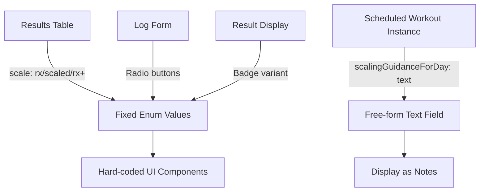
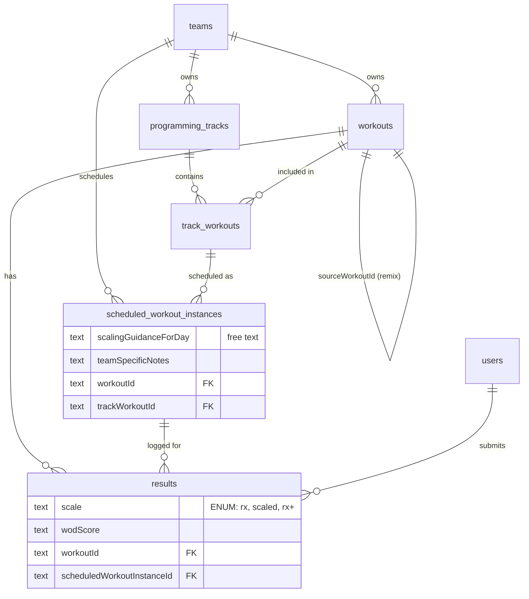
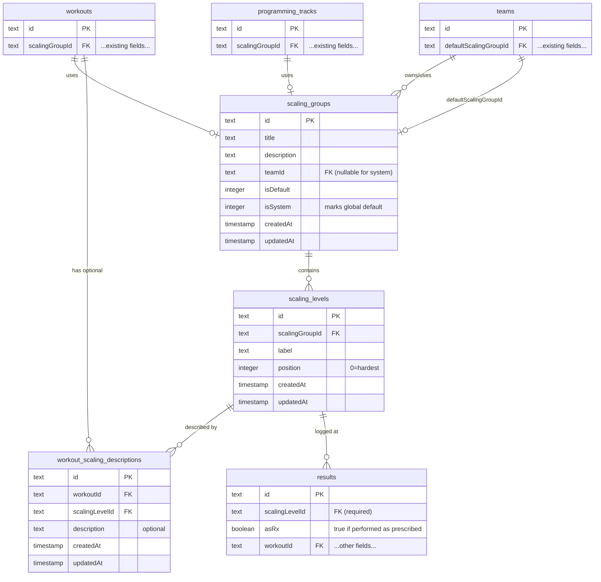
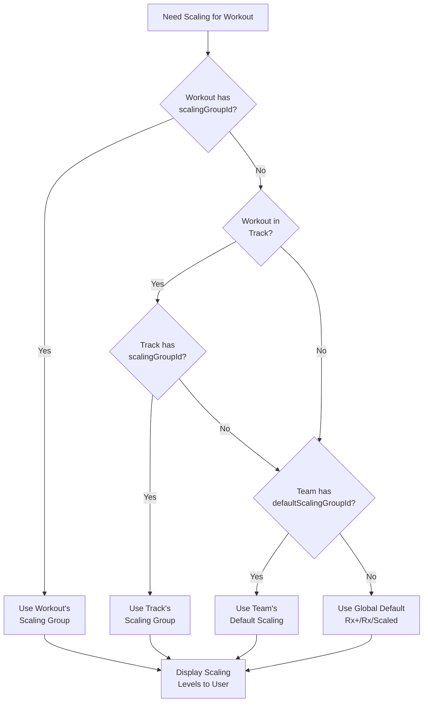
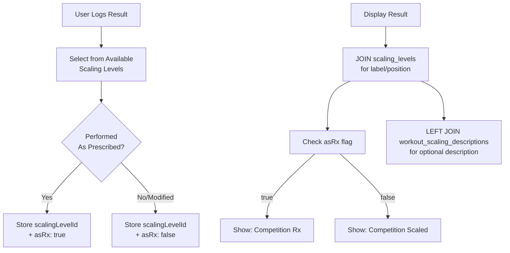
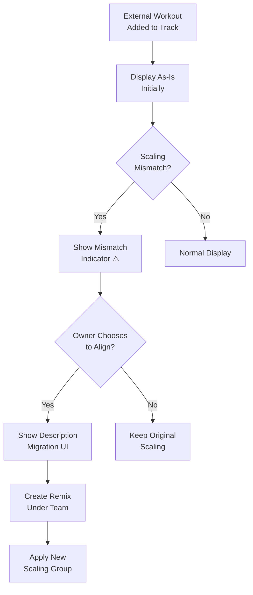

# Workout Scaling Levels - System Architecture & Implementation Plan

## Current System Architecture

### Existing Scaling Implementation

### Current Database Relationships

## Final Scaling Levels Architecture

### New Schema Design

### Scaling Resolution Flow (4-Level Priority)

### Result Storage and Display

### Workout Remixing Flow

## Key Implementation Details

### 1. **Data Migration Strategy**
- Create global default scaling group (id: "global_default") with Rx+/Rx/Scaled
- Migrate all existing results.scale enum values to reference these levels
- Drop scale enum column after migration complete

### 2. **Results System**
- Results store `scalingLevelId` + `asRx` boolean flag
- `asRx` = true: Performed as prescribed at that scaling level
- `asRx` = false: Modified/scaled within that level
- Display shows "Competition Rx" or "Competition Scaled" based on flag
- Scaling descriptions fetched via JOIN when displaying
- No duplication of scaling data in results table

### 3. **Remix Behavior**
- No automatic remixing - always explicit user action
- Visual indicators when scaling mismatches exist
- Description migration UI preserves context when remixing

### 4. **Team Isolation**
- Scaling groups readable by anyone who can read the workout
- Changing scaling triggers remix under your team
- Proper multi-tenant isolation maintained

### 5. **Performance Optimizations**
- Composite indexes on all foreign keys
- Caching strategy for scaling groups (KV/Redis)
- Global default cached in application memory
- Batch fetching for workout lists

## Implementation Issues (Linear)

### Phase 1: Database Schema ⚡ URGENT
- **WOD-50**: Create scaling groups and levels database schema
- **WOD-64**: Create global default scaling group for legacy data migration
- **WOD-51**: Update results table schema for scaling compatibility
- **WOD-52**: Generate and test database migration

### Phase 2: Backend Implementation
- **WOD-53**: Create scaling levels server functions
- **WOD-54**: Update result logging logic for unified scaling system
- **WOD-65**: Implement results query logic with scaling descriptions

### Phase 3: Frontend Implementation
- **WOD-56**: Create scaling group management UI
- **WOD-57**: Update result logging UI for new scaling system
- **WOD-58**: Update result display components for custom scaling
- **WOD-62**: Implement on-demand workout remixing
- **WOD-63**: Add scaling group selector to workout creation/edit forms
- **WOD-66**: Create scaling mismatch indicator UI component
- **WOD-67**: Implement scaling description migration UI

### Phase 4: Optimization & Polish
- **WOD-68**: Performance optimization for scaling queries
- **WOD-59**: Write comprehensive tests for scaling levels
- **WOD-60**: Create migration path documentation
- **WOD-61**: Documentation and code cleanup

## Summary

The refined scaling levels system provides:

✅ **Clear Resolution Path** - 4-level priority system that's predictable and flexible
✅ **Clean Migration** - Existing data seamlessly migrates to new system
✅ **No Auto-Remixing** - Explicit user control over workout duplication
✅ **Proper Isolation** - Multi-tenant boundaries respected
✅ **Performance Ready** - Caching and indexing strategies defined
✅ **Unified UX** - Single scaling system, no confusion

This architecture maintains backward compatibility while enabling teams to define custom scaling levels that match their specific needs.