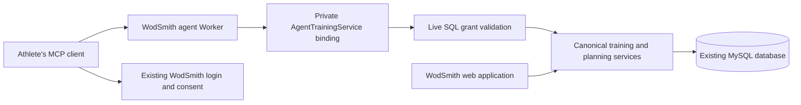

# Agent training

WodSmith exposes training through remote MCP so athletes can use their own assistant. The assistant supplies conversation and reasoning; WodSmith owns authorization, workout definitions, session composition, results, and durable planning state.

## Architecture

A separate Cloudflare Worker serves MCP and delegates named operations to the existing Start application through a private service binding.

OAuth protocol state lives in separate KV storage. SQL grants determine current scopes and permitted workspaces; token claims cannot widen them. Mutation transactions revalidate live grants and domain permissions. Disconnecting a connection or changing account credentials invalidates subsequent access.

## Build a week

The client uses the versioned blueprint and canonical tool schemas to guide a conversation, then saves a proposal that another authorized client can resume.

1. Read `get_training_context`, `get_training_week`, and `get_session_blueprint`. The week includes published programming and seven personal-day summaries. A day with only recorded results remains a projection until a composition is explicitly saved.
2. Ask for missing choices that affect the plan: training days, available time, equipment, preferred structure, and intended substitutions. The blueprint suggests warm-up, strength or skill, conditioning, and cooldown or mobility; each role is optional and separate from scoring.
3. Use `get_workout` or `list_workouts` for other accessible definitions. Preserve source occurrence IDs. An edited source prescription becomes a personal remix, retaining its provenance.
4. Save a proposal with `create_training_plan`. Each supplied day explicitly means train, rest, or leave open. Draft creation, reading, editing, and preview do not create live personal sessions.
5. Resolve required questions and constraints, then call `preview_training_plan`. Present its exact changes for the athlete to review.
6. Call `commit_training_plan` with the reviewed revision, preview digest, and an idempotency key. Changed source versions, session revisions, or authorization invalidate the preview. All affected days and the receipt commit together.
7. After a lost response, retry the same payload and key. `list_training_plans` and `get_training_plan` allow another client to find and resume the proposal. Reusing a key for different input fails.

For existing sections, omitting role or estimated duration preserves that metadata; explicit `null` clears it. Organization edits do not alter recorded prescriptions or results. Calendar dates are explicit date strings; clients should use the returned timezone and date context rather than treating dates as midnight UTC instants.

## Workout and result operations

Personal definitions, planned sections, recorded results, and published programming are distinct resources with distinct permissions and deletion behavior.

| Operation group | Contract |
| --- | --- |
| `create_workout`, `update_workout`, `delete_workout` | Operate on the athlete's owned personal library. Updates and deletion require the version returned by `get_workout`. Deletion archives the definition from new selection and retains it for existing references and history. |
| `create_result`, `get_result`, `update_result`, `delete_result` | Operate on owned source, personal, or direct library attempts. Edits and deletion require the current result version. Rich rounds, caps, units, scaling, and tiebreaks use the canonical scoring model. |
| `save_personal_training_day` | Replaces one composition using its expected revision. Removing an item retains performed history and does not delete a result. |
| `get_programming_week`, `save_programming_draft`, `publish_programming` | Require current programmer access; publication has its own explicit scope. Personal adaptations do not publish source changes. |
| `get_mutation_receipt` | Recovers the original mutation result and trusted originating client/grant identity. |

Mutation keys are scoped to the athlete and operation. A retry returns the original receipt only after current authorization succeeds. A new client cannot claim authorship of a previous client's mutation by replaying its key.

The first release has explicit boundaries: personal-day storage still uses the existing workspace context and rejects cross-workspace ambiguity; history reads return bounded collections of up to 100 entries each; scheduled and competition scores retain their original editing/deletion context. Current source-publication rules still govern source result writes.

## Enable a deployment

The checked-in gateway configuration is for local development. Production enablement requires reviewed schema promotion, environment-specific infrastructure, and client acceptance testing.

1. Apply the additive schema changes through the repository's normal environment process: migration 0010 adds planning drafts/receipts, 0011 adds OAuth grants/consent requests, and 0012 adds mutation receipts and the nullable workout archive column. Migration journal timestamps and snapshot predecessors must remain ordered. **The archive column is required before deploying the updated ordinary application, even if MCP is disabled.**
2. Configure separate OAuth KV storage, the canonical existing login origin as `AGENT_AUTH_ORIGIN`, and the exact public gateway resource URL including `/mcp` as `AGENT_RESOURCE`. Alchemy leaves the resource empty by default, disabling OAuth routes until configured.
3. Configure the gateway's `TRAINING` binding to the actual deployed Start Worker name and its `AgentTrainingService` entrypoint. Alchemy uses stage-specific names; the local `wodsmith-start` name must not be copied blindly. Keep demo and production storage and URLs separate.
4. Build and verify the actual custom Start entrypoint. The build checks must retain both the private service export and the existing WorkoutImportAgent. The OAuth provider's URL-based client metadata support requires `global_fetch_strictly_public` in the actual Alchemy deployment configuration.
5. Deploy the environment-specific gateway configuration and verify discovery, authorization, and tool execution against that deployment. Do not deploy the local HTTPS localhost configuration as production configuration.

See the [gateway README](../../apps/wodsmith-agent/README.md) for local commands and binding details. Existing main-branch automation pushes the demo schema before its deployment; production schema promotion and production deployment remain separate controlled steps.

## Client acceptance

Local Worker and SQL tests establish protocol and application behavior. They do not establish a successful connection from a real hosted ChatGPT or Claude account.

Before announcing support, connect a real account in each intended client and verify consent, a read-only grant, the weekly proposal conversation, reviewed commit, workout/result mutation, refresh, disconnect, and cross-client draft recovery. Confirm that restricted grants hide unavailable tools and that explicit delete/publication permissions produce the expected client review behavior.

The baseline is portable named MCP tools and structured data. Client-specific widgets, background coaching, notifications, hosted model execution, and a new personal-day data model remain separate work.
