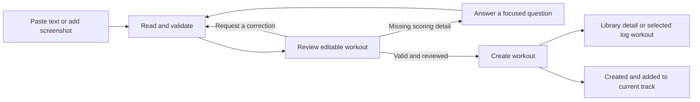

# AI workout import: UX implementation plan

Proposed implementation, researched September 5, 2026. This document describes future behavior; no application functionality is implemented by this plan. Pair it with [the infrastructure plan](2026-09-05-workout-import-infrastructure.md).

## Outcome and assumptions

An athlete or programmer can supply workout text or a screenshot, review a workout that matches WODsmith's scoring model, correct it, and save it in the place where they started.

The initial feature translates an existing prescription. It does not invent a training program, log a performance, or publish a schedule. The working assumption is one independently scored workout per import; a source containing multiple workouts must expose that fact and let the user choose which piece to import. Batch/session import can follow later.

The existing WODsmith controls, typography, theme, and authoring vocabulary remain the visual authority. This is an operation within workout creation, rather than a separate general-purpose chat destination. The UX decisions below are preliminary recommendations, not user-confirmed visual design.

## Current surfaces and integration map

The current application has no literal `/programmer` route. Programming management, discovery, workout creation, and logging are separate surfaces with different write destinations.

Paths below are browser URLs; their source files are under `apps/wodsmith-start/src/routes/`. `_protected` is a route group and is omitted from browser URLs.

| Surface | Current behavior | Proposed entry and completion |
| --- | --- | --- |
| `/workouts` | Library header links to `/workouts/new`. | Add a secondary **Create with AI** action beside **Create workout**, using the same creation destination. |
| `/workouts/new` | `CreateWorkoutPage` renders `WorkoutForm`; accepts `remixFrom`. | A compact **Paste text or upload a screenshot** panel above the form. Imported values become an editable draft; **Create workout** saves and opens its detail page. |
| `/settings/programming/$trackId` | `TrackDetailPage` uses `AddWorkoutToTrackDialog`, which selects an existing workout and asks for order and notes. | Add **Create with AI** alongside **Choose existing workout** inside the add flow. Preserve track, owning team, order, and notes. Final action: **Create and add to track**. |
| `/admin/teams/programming/$trackId` | `AdminTrackDetailPage` uses the same add dialog; its button checks the selected team's ownership. | The same shared flow and completion behavior; no separate importer implementation for this alias. |
| `/settings/programming` and `/admin/teams/programming` | Owned/subscribed track management. | Keep imports scoped to a selected writable track; an optional top-level shortcut must first establish a track or explicit library destination. |
| `/log/new` | Selects an existing workout, then collects date, scaling, score, and notes; accepts `workoutId`. | Add **Create workout from text or image** beside search and in its empty state. After save, select the new workout and return to the user's log draft. The user still enters and submits their result. |
| `/programming`, `/programming/$trackId`, subscriptions | Browse/subscribe/read track content. | An owner can navigate to management; do not imply subscribers can add to someone else's track. |
| `/workouts/$workoutId/edit` and remix creation | Edit reuses `WorkoutForm`; remix creates with source identity. | Initially enable importing for fresh creation. Later offer explicit replacement/revision with a diff and preserve remix provenance. Do not expose an import button automatically in edit mode merely because the form is shared. |
| `/workouts/$workoutId/schedule` | Schedules an already-created workout. | Scheduling remains a subsequent action. An imported prescription creates no scheduled instance automatically. |

Competition organizer/cohost event authoring uses `OrganizerEventManager` and different save contracts. `apps/crew` also contains copied components, but the workout tracking routes inventoried here belong to `apps/wodsmith-start`. Competition import and Crew rollout should be separate adapters after the shared draft contract is proven; they are not a reason to postpone programmer and athlete creation.

The existing [programming experience proposal](../mockups/training-experience/programming-proposal.md) describes a future weekly planner with sessions and blocks. It is not a shipped prerequisite. Keep the importer portable to that future block editor through a typed draft callback.

## Required entitlement behavior

AI import requires the new `ai_workout_import` entitlement in addition to workout tracking access and destination write permission. Creating this entitlement and enforcing it is a launch requirement.

Use server-resolved access for the displayed destination: the user's personal team for personal creation, or the owning team for a programming track. The existing system grants feature access per team, so membership in an unrelated entitled team does not unlock this destination. Changing destination requires another access check.

Unentitled users see a locked **Create with AI** entry with **AI Workout Import access required**, without an active upload or agent connection. Manual creation stays available. Do not offer a purchase link until a real purchase flow exists. Catalog creation does not automatically grant access; initial grants use the existing admin entitlement controls.

If access expires or is revoked while the workspace is open, show the access-required state and disable reading, revisions, retries and AI-workout saving. Server requests must reject the operation even if the browser still shows an enabled control. All three completion paths—library, track and create-and-return to logging—use the same entitled save service. Preserve local unsaved edits for recovery without starting more model calls or delivering restricted stored source data. Cancellation and cleanup remain available.

Add UX/integration cases for no grant, valid grant, wrong-team grant, permission loss, grant expiry and revocation after draft creation but before save. Verify both the visible controls and direct server requests; an entitled preview is not a lasting authorization to save.

## Shared interaction

Use one import workspace with three understandable phases: source, review, and save. Users can return to the source and revise without leaving their creation context.

### Source

Show a text area and a clearly labeled image picker, with supporting copy: **Paste a workout or upload a screenshot. We'll fill in the workout and scoring fields for you to review.**

- Support pasted multiline text and a single PNG, JPEG, or WebP screenshot in the first release. A visible file picker works on desktop and mobile; image paste and drag/drop are enhancements. Permit optional text alongside an image for instructions such as “Use the scaled version.”
- Proposed initial limits are one image up to 10 MB and 20,000 text characters, subject to backend/provider validation. Show actual accepted types and limits before upload. Reject unsupported or oversize input with instructions to choose another file or paste the workout text.
- Display an image thumbnail, filename, remove/replace controls, and a larger preview. Never substitute OCR text for the user's ability to inspect the original.
- Show the destination immediately: **Private workout · Personal team** or **Add to Strength track · Northside**. Resolve this from authenticated context, not extracted text or whichever team happens to be first in an array.
- Primary action is **Read workout**. Disable it for empty input, invalid files, or an active request. Manual creation remains available.
- Upload originals to short-lived private storage through an authorized endpoint. Do not put screenshot contents, filenames, pasted text, or OCR into analytics or persistent URL parameters. Tell users succinctly that the image is sent for AI processing; align the retention wording with the implemented retention policy.

### Reading and clarification

Give honest progress and useful recovery while the agent constructs a schema-validated proposal.

- Show states such as **Uploading image**, **Reading workout**, and **Checking scoring**, driven by actual backend stages rather than a fabricated percentage. Keep the source visible.
- Offer **Cancel** and retain source input. Leaving the overlay should explain whether work continues and allow reopening the same request; durable state makes reconnecting a continuation rather than a second inference job.
- When source text is unreadable, show any extracted text that is usable and ask the user to correct it or replace the image. Do not create a plausible workout from a failed image read.
- If the source has two separate scoring pieces, say **This has more than one workout. Choose which to create first.** Show the identified pieces. Keep warm-up instructions in context, but do not silently merge a strength max and an AMRAP into one score.
- Ask focused questions beside the relevant field: **Is the result total reps or rounds + reps?** Users may answer directly through the scoring controls. Never force a conversational answer to something the form can express precisely.

### Review

The editable workout is the main result. Retain a collapsible source panel and concise explanations for ambiguous or inferred fields.

Use the existing editor fields for name, description, movements, scoring method, aggregation, visibility, time cap, and separately recorded scores. On wide screens put source next to the editor; on mobile use a single column with a **View source** disclosure. The interface should not require reading a chat transcript to understand the saved result.

Separate **Needs your input** items that block saving from optional notices such as **Suggested title**. Explain uncertainty with source evidence rather than numeric confidence badges. A generated title is acceptable when none was supplied, but label it as suggested. Do not invent missing prescriptions, units, round counts, or tiebreaks.

Allow both direct edits and a small **Ask for a change** field, for example “The cap is 12 minutes, not 15.” TanStack AI generates each correction from the source, current reviewed draft and requested change; new agent output is an immutable proposal revision. Compare it against the last accepted revision and current local edits; show changed fields and apply only after the user accepts. Never overwrite fields the user edited while a response was in flight. Ignore late responses for replaced sources or canceled request IDs.

For fresh creation, applying a validated import draft to `WorkoutForm` happens as one explicit editor action. Its current local `useState(initialData...)` initialization does not respond to later `initialData` changes; implement a controlled draft reducer or explicit versioned apply action. Avoid an effect that resets all form state whenever an agent state update arrives. Preserve cancel/undo of the last application.

### Save and return

Only an explicit save persists the workout. Button copy states whether an additional track link will be created.

- Library: **Create workout** saves once and navigates to the detail route.
- Track: show the track, position, and notes in the final review; **Create and add to track** commits both records atomically with idempotency. Success returns to the current track and makes the inserted row visible. Adding to a track is not scheduling or publishing.
- Logging: **Create and use workout** saves and selects it in `/log/new?workoutId=...`; retain the selected date and notes. Reset score/scaling inputs only when replacing an already-selected workout would make those values incompatible, with a clear explanation.
- Failed save retains every edit. Retrying a request with an uncertain outcome returns the same saved workout instead of duplicating it. Expired authorization requires reauthentication or destination correction before saving.
- Default visibility remains private. Public visibility is an explicit user setting shown at save; the model cannot choose ownership or publish content based on screenshot instructions.

## Scoring and persistence requirements

The editor must present only semantics the actual creation endpoint can persist and the score entry UI can honor. A natural-language summary alone is insufficient verification.

| Source example or ambiguity | Review behavior and contract requirement |
| --- | --- |
| “AMRAP 12: 5 pull-ups, 10 push-ups, 15 squats” | Propose `rounds-reps`, explain one final rounds/reps result, retain duration and prescription in description. Do not turn the AMRAP duration into a `time-with-cap` field. |
| “3 rounds for time” | Keep three prescription rounds in description; normally `roundsToScore=1`. Label the latter **Number of separately recorded scores** so it is not confused with exercise rounds. |
| “5 sets, score your heaviest lift” | Verify whether five scores are recorded and max aggregated, or one final max is entered. Ask if the source is ambiguous. |
| “For time, 15-minute cap” | Propose `time-with-cap`; show 15:00/15 minutes and persist 900 seconds. Explain capped scoring with reps and show an example score-entry affordance. |
| “Every minute for 10 minutes” | Recognize EMOM format, but do not infer that ten separate scores or max reps are necessarily intended. Clarify what the athlete records. |
| Tiebreak time, reps per round, or scaling prescriptions | The DB supports more than the personal creation form. Extend the reviewed save contract and editor for supported values, or identify the unsupported detail and block a falsely complete import. Never silently drop score-changing fields. |
| Movement name with multiple matches | Use actual movement IDs with visible matched labels. Offer a picker for uncertain matches and preserve unmatched source text; no automatic catalog creation in this release. |
| Weights such as `95/65` without units | Preserve source and request units when needed. Do not guess pounds/kilograms based only on customary gym notation. |

`WorkoutFormData` currently includes `movementIds`, but `createWorkoutInputSchema` in `server-fns/workout-fns.ts` does not accept them and `createWorkoutFn` does not persist junction rows. The current form/create path also omits DB fields such as `repsPerRound`, `tiebreakScheme`, and `scalingGroupId`. Fix the declared import/save contract before presenting these as successfully imported.

`createWorkoutFn` and `addWorkoutToTrackFn` currently check authentication but do not establish target-team/track authorization in their handlers. The new integration must verify workout tracking entitlement, the required `ai_workout_import` entitlement for the resolved destination team, destination ownership/membership, and programming write permission server-side at generation and commit. Page visibility checks alone are insufficient. The model is never the authority for destination IDs.

## Responsive behavior, accessibility, and failures

The shared workspace must remain usable on a phone with a keyboard open, and every import operation must be possible without drag/drop or a mouse.

- Use the incumbent Radix dialog primitives for focus management. Avoid stacked modal dialogs: replace the add-to-track dialog's content with the import workspace, or hand off to one workspace with preserved context. On small screens use a full-height sheet/dialog with one scroll region and a reachable action footer.
- Keep focus on the next unresolved field after validation, and restore it to the invoking action after close. Give controls explicit labels, visible focus, described errors, and keyboard-accessible upload/remove/source-preview controls.
- Announce stage changes and completed draft availability with a polite live region. Announce blocking errors assertively once. Do not announce every streamed token or move focus while the user is editing.
- Use text and icons alongside status color. Large source text and narrow screens must wrap; image zoom must not cause document overflow. Respect reduced motion and support 200% zoom.
- A quota or rate limit response preserves input and shows a useful retry condition if the server knows it. Provider outage, malformed output, disconnect, upload failure, expired source, permission loss, and commit failure need distinct recovery actions.
- Reopening an in-progress authorized draft resumes it. If an expired image needs uploading again, retain editable extraction and corrections where retention policy permits. Do not pretend a browser-held file survives a reload.

## Implementation sequence and touchpoints

Build the shared draft contract and one end-to-end creation path before multiplying entry points.

1. **Entitlement, contract and save readiness.** Create the required `ai_workout_import` catalog feature and admin grant/revoke support, enforce it at all agent and AI-save boundaries, then agree the schema and unresolved-issue representation with the infrastructure plan. Extract reusable create validation, persist movement relations and supported scoring fields, validate scope/ownership, and add idempotent atomic create-plus-track insertion. Verify these against real score entry behavior.
2. **One vertical slice.** Add proposed `components/workout-import/workout-import-workspace.tsx`, source/review components, and `hooks/use-workout-import.ts`. Connect structured import/revise RPC to a plain Cloudflare `Agent` running TanStack AI `chat()` with `outputSchema` and the TanStack Cloudflare adapter. Keep the existing Agent state/RPC transport for stages and validated revisions; any later conversational UI uses TanStack AI client integration with an explicit compatible transport. Integrate `/workouts/new` with explicit versioned draft application in `components/workout-form.tsx`.
3. **Programmer integration.** Extend `components/add-workout-to-track-dialog.tsx` with choose-existing/create-with-AI modes. Both `settings/programming/$trackId/index.tsx` and `admin/teams/programming/$trackId/index.tsx` consume that adapter. Preserve destination/order/notes and return to the refreshed list only after the atomic commit succeeds.
4. **Library and logging entry points.** Add the shortcut in `_protected/workouts/index.tsx`, then the create-and-select action in `_protected/log/new/index.tsx`. Keep route return context allowlisted and typed; retain unsaved log form fields during the handoff.
5. **Verification and rollout.** Run source fixtures and route flow tests, then bounded desktop/mobile review of the actual UI. Release only to a small group explicitly granted `ai_workout_import`; any rollout flag is an additional restriction; measure successful editable drafts and saved imports, not token-stream length.

Relevant existing files include `server-fns/workout-fns.ts`, `server-fns/programming-fns.ts`, `server-fns/movement-fns.ts`, `lib/scoring/`, `utils/score-parser-new.ts`, and `packages/wodsmith-db/src/schemas/workouts.ts`. Agent transport, draft storage, upload lifetime, package upgrades, and inference controls are owned by the infrastructure plan.

Before implementation edits, run GitNexus impact analysis on every existing symbol being changed, particularly `WorkoutForm`, `CreateWorkoutPage`, `AddWorkoutToTrackDialog`, `LogNewPage`, `createWorkoutFn`, and `addWorkoutToTrackFn`. The research-stage context query confirms `WorkoutForm` is shared by create and edit, so preserve edit behavior deliberately.

## Acceptance criteria

Ship when a reviewed draft reliably becomes the intended workout and the same journey works from every first-release entry point.

- Text and screenshot fixtures for AMRAP, capped time, load, EMOM, ambiguous units, unclear image text, and multi-workout sources produce either an accurate editable proposal or a specific unresolved question.
- “Three rounds for time” does not become three score inputs; a 15-minute cap persists as 900 seconds; an AMRAP duration does not become capped-time scoring.
- Recognized movements and every supported scoring field survive save and reload. Unsupported scoring semantics cannot disappear while the UI reports success.
- A user can correct extracted text, edit scoring directly, request another revision, reject a revision, and undo applied values without losing concurrent manual changes.
- Canceling generation creates no workout or track entry. Double-clicking save and retrying after a disconnected response create exactly one workout and, when requested, exactly one track link.
- Both programmer route aliases create into the displayed owning team/track and preserve order and notes. No scheduling or publication occurs implicitly.
- Logging creation returns with the new workout selected and the prior date/notes intact; no score is submitted automatically.
- Another user's draft, image, or target team/track cannot be read or written through a guessed ID. Permissions and entitlements are rechecked on reconnect/generate/revise/save.
- Keyboard-only and mobile users can upload, inspect source, resolve errors, edit, and save. The workspace is usable at 200% zoom and returns focus correctly.
- Existing manual create, edit, remix, choose-existing-track-workout, and result logging continue to work when AI is unavailable or disabled.

Use meaningful integration tests for schema roundtrips and atomic/idempotent persistence, component tests for draft application and focused errors, and end-to-end tests for the three destinations. Add future test specifications and corresponding `@lat` references as implementation lands, rather than marking proposed tests as already implemented.

Track `workout_import_started`, `workout_import_ready`, `workout_import_needs_input`, `workout_import_failed`, and the existing `workout_created` event enriched with import source type/destination. Record stage durations, issue categories, revision count, and outcome. Exclude workout text, images, model messages, and raw error details from analytics.

## Research limits and open product choices

This plan is grounded in checked-in routes, forms, server functions, the shared workout schema, and `lat.md` architecture/domain documentation; it is not an authenticated live-site usability audit.

`lat expand` ran. Semantic `lat search` failed because the environment could not resolve `api.openai.com`; direct `lat locate` and source reads supplied context. GitNexus initially lacked this checkout; after indexing, query/context calls succeeded for the absolute worktree path.

Defaults proposed here allow implementation planning to proceed: one scored workout per import, private visibility, PNG/JPEG/WebP plus text, explicit reviewed save, and workout-tracking rollout before competition adapters. Before final UI implementation, settle pricing/plan packaging for the required AI import entitlement, the actual upload/retention limits, and whether the first scoring contract includes tiebreak and structured scaling or blocks those cases pending a later release.
