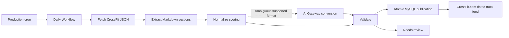

# CrossFit.com daily programming import

Approved architecture for importing CrossFit.com's daily programming into Wodsmith at 05:00 PST. The implementation is present in this worktree; production migration and activation remain pending.

## Implementation and activation

The implementation adds the durable workflow, validated source adapter, constrained scoring converter, transactional publisher, dated track feed, and administrator preview/retry controls described below.

- Schedule: 13:00 UTC daily (05:00 PST year-round; 06:00 during Pacific daylight time), with a 15:15 UTC publication health check. Both are production-only Alchemy cron triggers.
- Conversion: explicit rest, narrow timed and rep-count prescriptions, and simple load sets use deterministic parsing. Other supported formats use `workers-ai/@cf/meta/llama-3.3-70b-instruct-fp8-fast` through the existing gateway. Invalid output remains private for review.
- Storage: the additive `packages/wodsmith-db/mysql-migrations/0002_milky_katie_power.sql` creates only the import ledger and component relation. No existing workout or scoring table is altered.
- Review: site administrators can preview a date without database writes, publish an explicit date, and inspect workflow status and source text from the CrossFit.com track page. There is no edited-output approval or published-revision editor in this version.
- Scope: source text retains scaling and movement instructions. This version does not add catalog movement matching, structured scaling, automatic gym scheduling, or historical backfill.

Verification includes twenty-four focused tests: source/scoring validation, workflow retries and dry-run isolation, component display, and actual MySQL publication with the migration, concurrent retries, manual append ordering, and rollback. The MySQL run uses a disposable database on a task-owned local socket or loopback TCP port. Type checking, schema ownership, production build, and `lat check` are also part of the final checks.

A temporary database-free Cloudflare preview exercised the actual source adapter and converter against September 1–6, 2026. Rest, simple time, explicit rep-count scoring, and the seven-set load prescription required no AI in the final converter. The composite day returned separate time/min and load/max components with no cap (553 tokens in the schema-enabled evaluation). The edge test exposed an unsupported redirect setting and an invalid initial model response; manual redirect rejection, schema transmission, and an explicit JSON contract corrected those failures. Additional checks caught an invented time-cap component on the rep-count day and a lost set count on the load day; explicit source rules now handle both without AI. Six real days establish these paths, not exhaustive accuracy for all mainsite programming.

Production activation must follow the existing release sequence:

1. Review the code and additive migration together. Apply only the two-table migration on a PlanetScale development branch, inspect its schema diff, and deploy it to `wodsmith-db/main` using a PlanetScale deploy request. Do not use `db:push` on production.
2. Merge the reviewed application changes, then dispatch `.github/workflows/deploy.yml` from `main` with `stage=prod`, completing the production environment approval. The production deployment workflow also sends its configured Slack deployment notifications.
3. Verify `crossfit-daily-import-workflow-prod`, the `CROSSFIT_DAILY_IMPORT_WORKFLOW` binding, and both cron triggers on `wodsmith-app-prod`.
4. Preview the deployment date through the administrator controls, then publish it and inspect the dated track entry and ledger. Confirm a replay returns the existing publication. The next cron continues automatically.

The schedule becomes active with the production app deployment. Roll back scheduling by removing its two production cron entries through Alchemy; retain the additive tables and previously published rows. The health cron detects missing publication while the Worker remains scheduled; independent monitoring is still needed to detect removal of both cron entries.

## Verified infrastructure and destination

The review on September 5, 2026 (September 6 UTC) inspected local source, the deployed Cloudflare Worker, and PlanetScale through a reader-only connection.

| Item | Observed state |
| --- | --- |
| Production Worker | `wodsmith-app-prod`; deployed handlers are `fetch` and `queue` |
| Infrastructure owner | `apps/wodsmith-start/alchemy.run.ts`; the checked-in Wrangler file does not describe all production bindings |
| Database | PlanetScale `wodsmith-db`, production branch `main`, MySQL via `HYPERDRIVE`; query caching disabled in IaC |
| Existing production Workflows | `stripe-checkout-workflow-prod`, `manual-registration-workflow-prod`, hosted by the main Worker |
| AI | Deployed `AI` binding and `CF_AIG_GATEWAY=wodsmith-prod`; the judge scheduler demonstrates the AI SDK gateway adapter |
| Storage and monitoring | Public uploads R2, private downloads R2, Sentry, and evlog/PostHog integration |
| Destination | `ptrk_crossfit_dotcom`, named `CrossFit.com`, public, `official_3rd_party`, no competition association |
| Owner | `team_cokkpu1klwo0ulfhl1iwzpvn`; no track scaling group currently assigned |
| Existing content | 114 track workouts, maximum order 116; highest-order entry has notes for 2025-12-03 |
| Distribution | Three active track subscriptions; 111 existing scheduled instances reference this track |

The current worktree has no GitNexus index. Exploration used the registered main checkout's graph to locate symbols, then verified behavior against this worktree's source. Production column inspection confirmed snake_case SQL names, matching the shared Drizzle database factory.

## Source acquisition

Use the public JSON endpoint consumed by CrossFit's own website, retaining the short daily URL for attribution.

- Human URL: `https://www.crossfit.com/260906`.
- Data URL: `https://www.crossfit.com/workout/2026/09/06`.
- Verified fields under `wods`: `id`, `cleanID`, `title`, `wodRaw`, `wodHtml`, `publishingState`, `url`, `modified`, and publication timestamps.
- The page shell embeds date metadata, but does not contain the full workout. Its frontend fetches the data URL separately.

Direct requests returned HTTP 200 and `application/json` for September 4–6. September 6 explicitly says Rest Day. September 5 is one timed workout with Intermediate and Beginner options. September 4 contains a timed workout followed by a load component; its 20-minute instruction is a start time, not an explicit time cap.

This is an observed public website endpoint, not a documented integration contract. Put it behind a source adapter with fixtures and response validation. A changed payload must fail visibly. Rendered-page extraction can be added as a fallback if the endpoint stops working; do not add Browser Rendering as an initial dependency.

Fetch only the configured CrossFit host and constructed date path, with timeout and response-size limits. Validate `cleanID`, `url`, language, published status, and nonempty Markdown before conversion. Never interpret missing content as a rest day or substitute the latest available workout. Retain source Markdown and a content hash; show the original daily link in Wodsmith. Site content is data, never executable instructions.

## Schedule and hosting

Add `CrossFitDailyImportWorkflow` to the existing Worker and register it through Alchemy alongside the two existing Workflows.

The proposed binding is `CROSSFIT_DAILY_IMPORT_WORKFLOW`, with workflow name `crossfit-daily-import-workflow-${stage}`. Export the class from `src/server.ts`. Add a small `scheduled` handler to create an instance with a deterministic identifier such as `crossfit-2026-09-06` and explicit `{ sourceDate, mode: "publish" }` parameters. Await instance creation so dispatch failures are visible.

Configure the cron only for `stage === "prod"`. Reuse the existing database and AI bindings. No extra queue, Durable Object, database, or autonomous Agent is needed for one durable daily import. Existing Workflows already establish the deployment pattern.

| Meaning | Schedule |
| --- | --- |
| Literal 05:00 Pacific Standard Time, UTC−8, requested here | `0 13 * * *`; 06:00 on California clocks during daylight saving time |
| 05:00 Pacific local time throughout the year | `0 12,13 * * *`, dispatch only when the scheduled timestamp is 05:00 in `America/Los_Angeles` |

Derive the source calendar date from the scheduled timestamp and chosen timezone policy, then persist it in the workflow payload. Retries retain that date even across midnight. Manual runs require an explicit date. The schedule starts work at 05:00; publication follows successful extraction and validation, rather than promising a completed write at exactly 05:00.

Cloudflare also supports schedules directly on Workflow bindings in current documentation. The CLI available during inspection was Wrangler 4.30.0, so use the established Worker cron pattern unless the project's Alchemy/Wrangler support for direct schedules is verified during implementation. Manage the schedule through IaC so subsequent deploys preserve it.

## Durable steps

Each external operation belongs inside a persisted workflow step, with bounded retries appropriate to that operation.

1. **Load import identity.** Resolve the configured track ID and verify public third-party type, owner, and absence of a competition. Return an existing successful result when replaying an imported date.
2. **Fetch and snapshot.** Read the exact date's JSON, validate its identity, and persist original Markdown plus source metadata. An optional full-response archive can use a private R2 prefix; never put import diagnostics in the public uploads bucket.
3. **Extract and normalize.** Split prescription, stimulus, scaling, and resource sections without rewriting the prescription. Detect explicit rest days. Classify straightforward scoring formats deterministically; use one constrained AI call for ambiguous supported formats.
4. **Validate.** Parse a Zod discriminated union for `rest` or `workout`, with an ordered array of scoreable components. Verify source-backed fields before allowing publication.
5. **Publish.** Within one short database transaction, lock the import row, recheck completion, create all workout/link rows, and mark the day published. Fetches and AI calls happen before opening this transaction.
6. **Observe.** Record workflow ID, source date/hash, parser/model version, destination IDs, outcome, duration, and AI usage. Surface failures and held imports through existing monitoring and an administrator review surface.

Retry transient network errors, 429s, and 5xx responses with backoff; honor Retry-After. Treat a not-yet-published day as pending and retry at a bounded interval, for example every 15 minutes for up to two hours. Exhaustion remains failed/pending, never rest. Payload identity mismatches, incompatible schemas, and unsupported scoring enter review. Explicitly log and rethrow terminal errors so the Workflow does not appear successful.

## Wodsmith mapping

Preserve the original prescription while mapping only the fields Wodsmith needs for scoring and discovery.

| Source | Proposed destination |
| --- | --- |
| Date and canonical URL | Import row `sourceDate` and `sourceUrl`; date-based workout name and track notes |
| Main prescription | Existing `workouts.description`, retaining meaningful Markdown, weights, units, and gender-specific instructions |
| For time | `scheme: "time"`, `scoreType: "min"` |
| AMRAP scored in rounds/reps | `scheme: "rounds-reps"`, `scoreType: "max"` |
| Explicitly scored load | `scheme: "load"`; aggregation follows source instructions, not a universal default |
| Explicit time cap | `scheme: "time-with-cap"`, `timeCap` in seconds; do not infer caps from timing guidance |
| Several independently scored parts | Separate workout and track-link rows grouped under the same import date |
| Intermediate / Beginner | Preserve labeled source sections in the description initially; structured scaling requires an intentional track-level scaling group |
| Movements | Match known catalog IDs conservatively; uncertain matches remain text rather than creating duplicates |
| Ownership and visibility | Existing track owner, `scope: "public"`, `sourceTrackId: "ptrk_crossfit_dotcom"` |

`roundsToScore` means score entries, not necessarily the prescribed number of rounds. Values must match explicit requests to record a number of scores or the validated load-set count; otherwise only one is accepted. Non-timed minimum scores and unsupported sums/averages stay private for review. Do not derive repetitions per round by adding meters, hold seconds, calories, and repetitions together. Leave optional fields unset when they cannot be represented faithfully.

The converter receives only the relevant source text and allowed schema/catalog values. It has no browser, database, or publishing tools. It must identify the source spans supporting scoring decisions and component boundaries; validate spans against the original text. Schema success and model self-reported confidence are insufficient to prove semantic correctness. Unsupported formats stay available for review, with the exact original text preserved.

Reuse Workers AI through the deployed gateway adapter. Select a model by evaluating representative source fixtures and structured-output reliability; the model used by judge scheduling is not automatically the right importer model. Bound output tokens, runtime, and repair attempts, and retain the model/prompt version with the import. Never let the model choose the destination track or database IDs.

## Dates, rest days, and duplicate prevention

Add an import ledger because the existing track-workout schema provides sequence order without a source date or a non-scoreable rest-day representation.

Proposed `external_workout_imports` fields include provider, track ID, source date, source URL/ID, source modification timestamp, content hash, original Markdown, normalized payload, parser/model version, workflow ID, status, error summary, and created/published timestamps. Enforce a real unique index on `(provider, track_id, source_date)`. Use a small `external_workout_import_items` relation to link the import to its ordered workout/track-workout rows; enforce unique `(import_id, component_index)`.

An explicit rest day is a published import with `kind: "rest"` and zero scoreable items. Extend the track read model and view to merge dated imports with the existing library, showing Rest Day without a score button. The current score scheme enum has no rest value; inventing a timed or pass/fail workout would produce misleading logging behavior.

The public track reader currently shows rows regardless of competition-oriented `eventStatus`. Therefore, `eventStatus: "draft"` cannot hide an uncertain import. Keep pending/review data solely in the ledger until the atomic publication transaction creates the public workout rows.

Workflow IDs reduce duplicate dispatches; database uniqueness is the durable publication guarantee. A crash after commit but before step acknowledgement must return the committed workout IDs on retry. A rest day must deduplicate identically. A restarted instance must not regenerate or republish completed content automatically.

Allocate ordinary track order under a track-row lock through a shared append service. Every writer that allocates order on that track must follow the same locking convention. Existing manual append paths need review because their caller-supplied order does not currently enforce this. Keep the source date separate: `trackOrder` is `DECIMAL(6,2)`, so YYYYMMDD and YYMMDD are invalid order values. The index named `track_workout_unique_idx` is an ordinary index, not a uniqueness guarantee.

For source corrections or local editorial changes after publication, store the new source version for review and require an explicit revision action. Do not silently overwrite workouts with logged results. Do not mass-backfill the gap since the highest-order 2025 entry as part of enabling the daily schedule; an explicit date-range import can reuse the same validation and deduplication later.

## Track publication and gym calendars

Publishing to the shared CrossFit.com track satisfies the requested destination, while gym scheduling remains a separate distribution policy.

Existing subscriptions add the track to a team's library. `scheduled_workout_instances` is a separate model. The newer `/training` interface reads published, gym-owned `training_sessions`; its documentation explicitly excludes automatic track-template import. An import into `workouts` and `track_workouts` alone will not appear automatically in that interface.

The initial proposal publishes the dated shared track feed and lets gyms schedule from it. Automatic gym distribution would be a follow-on adapter with an explicit opt-in, gym-local date policy, membership/entitlement checks, and conflict handling for already programmed days. It must follow training session revision/publication rules. Do not create sessions for all three subscribers merely because they subscribe today.

## Verification and rollout

Build the source adapter, ledger, dated track read model, and publisher first, then enable the production schedule after end-to-end verification.

1. Fixture tests for rest, timed workout, AMRAP, load, capped workout, scaled variants, and multiple scoreable components. The September 4 fixture must produce both time and load without inventing a 20-minute cap.
2. Failure tests for missing/late publication, wrong date, empty content, malformed JSON, unexpected redirects, changed schema, invalid AI output, and source text that attempts to issue instructions.
3. Database tests for concurrent imports, manual versus automated append order, transaction rollback, retry after commit, rest-day replay, and preservation of editorial changes and existing results.
4. Schedule tests for literal PST, the optional local-Pacific policy across DST changes, delayed invocations, and retries across midnight.
5. Render checks for dated entries, grouped components, visible rest days, source attribution, and no public exposure of held imports. Verify the source adapter from the Cloudflare runtime: local HTTP success alone does not establish that requests from Cloudflare will succeed.
6. Run a dry-run over a representative historical sample, then manual publication in a nonproduction database. Dry-run must never create production workout/link rows. After deployment, inspect the live Workflow binding and cron; add a missing-daily-success check so a removed cron does not fail silently.

One daily fetch and at most a small number of conversion calls should have modest incremental usage relative to the existing infrastructure. Actual cost depends on the evaluated model and retries; record tokens and gateway usage rather than quoting a price before selecting a model.

The implementation touches Alchemy, `src/server.ts`, the workflow/source adapter/converter/publisher, shared database schema plus migration, programming reads/UI, focused tests, and lat.md. GitNexus impact analysis preceded existing-symbol edits. No production schema, workout data, cron, or application deployment has been changed by this work.

## References

These sources support the extraction observations and Cloudflare execution choices.

- [CrossFit September 6 page](https://www.crossfit.com/260906) and [public workout JSON](https://www.crossfit.com/workout/2026/09/06).
- [September 5 JSON](https://www.crossfit.com/workout/2026/09/05) and [September 4 JSON](https://www.crossfit.com/workout/2026/09/04).
- [Cloudflare Cron Triggers](https://developers.cloudflare.com/workers/configuration/cron-triggers/): UTC schedules and scheduled handlers.
- [Trigger Workflows](https://developers.cloudflare.com/workflows/build/trigger-workflows/): Worker dispatch and direct Workflow schedules.
- [Sleeping and retrying](https://developers.cloudflare.com/workflows/build/sleeping-and-retrying/): durable waits, retry policies, and terminal errors.
- [Rules of Workflows](https://developers.cloudflare.com/workflows/build/rules-of-workflows/): persistence and idempotent side effects.
