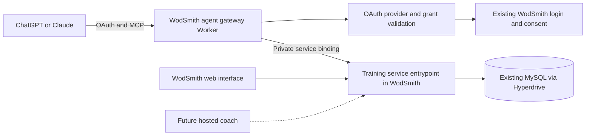

# Agent-first WodSmith training

Implementation was authorized on September 12, 2026. The subsequent delivery plan is [Agent training delivery](../plans/2026-09-12-agent-training-delivery.md). The inspected checkout's athlete/workspace/date storage below is historical: the coordinated personal-session redesign targets one athlete-owned session per calendar date across teams. Team identity remains attached to source access, provenance, and comparisons.

## Recommendation

Build a new **WodSmith agent gateway** in the existing monorepo: a Cloudflare Worker exposing authenticated remote MCP tools over the existing training domain. Keep WodSmith accounts, programming, personal sessions, and results as the authoritative records. Let ChatGPT, Claude, and other compatible agents supply the conversation and reasoning.

The first product should help an athlete turn published programming and personal additions into a saved week, then record and correct what they actually performed. Its distinguishing capability is a structured, resumable planning process with reliable persistence—not merely a collection of database operations.

Use three complementary layers:

| Layer | Responsibility | Initial implementation |
| --- | --- | --- |
| Training application services | Ownership, access, scoring, snapshots, concurrency, mutations | Extract and reuse existing WodSmith logic |
| Remote MCP gateway | Agent discovery, typed tools, OAuth, structured responses | New Worker, proposed location `apps/wodsmith-agent` |
| Session-building guidance | Ask useful questions, assemble sessions, explain changes | Versioned blueprint, tool guidance, optional host skill |

MCP and an API are complementary. MCP supplies the agent-facing contract; transport-independent application services supply the underlying behavior. A versioned JSON API can expose the same operations for scripts or future integrations. A WodSmith-hosted coach can later call those services too, without becoming a prerequisite for athletes who bring their own agent.

This recommendation is based on source and documentation inspected on September 12, 2026. Kody was inspected at commit `72d0c62d821fb03fffe179d147c4cf5190cee484`; the WodSmith checkout was `0d36543dd0a5c7ad2958f8fcf2b1328998e31c15`. Proposed names, schemas, permissions, and delivery phases below are design proposals, not existing capabilities. The checkout contains session-building code, but its production deployment and any newer work on other branches were not verified.

## What Kody demonstrates

Kody is Kent C. Dodds’s multi-user assistant application, rather than a small reusable agent framework. Its stated purpose is to give an assistant persistent capabilities across MCP hosts. It explicitly does not target shared organizational workspaces or fine-grained delegation among humans. That distinction matters because WodSmith combines athletes, gyms, publishers, and shared programming.[^1]

### A small external interface over a capability registry

The actual registration code installs two tools, `search` and `execute`, plus onboarding prompts. Search discovers capabilities, guides, integrations, packages, and other entities. Execute runs a supplied module against a capability registry. The registry derives handlers, schemas, descriptions, and discovery metadata from domain definitions rather than maintaining separate inventories.[^2]

This is a useful scaling pattern for a very broad application. WodSmith should adopt the single capability-definition source, including required permission, input/output schema, examples, and mutation characteristics. It should initially expose a bounded set of named training actions. An athlete’s first week does not require an arbitrary code runtime.

Kody’s execute tool is correctly annotated as potentially destructive, non-idempotent, and open-world. Consequently, its tool-level metadata cannot tell a host that one particular execute call merely reads a week while another deletes records. Named WodSmith actions make that distinction inspectable. Add capability search or constrained batch execution later if measured discovery cost justifies it.[^3]

### Persistence that survives a host change

Kody scopes stored state to its owner across storage systems. It also makes a subtler distinction: a user is not a conversation. Two agents connected to one account may be working independently. Persistent workflows therefore need explicit identifiers passed by the caller, rather than inferred connection state.[^4]

For WodSmith, the transferable object is a `trainingPlanId`. An athlete can start planning in ChatGPT, resume that same plan in Claude, and inspect it in WodSmith. A second planning conversation can create a separate proposal. Both must still compete against the current revision of the same underlying personal sessions when saving.

Portable state should include the proposed week, selected sources, constraints, unresolved questions, and saved revisions. It does not require copying chat transcripts or provider-specific model memory into WodSmith.

### Cloudflare primitives selected by workload

Kody’s current production architecture separates origin, platform, runtime, and jobs Workers. The origin serves the application, OAuth, and MCP HTTP; other Workers own durable coordination, package execution, and jobs. This split also supports deployment isolation.[^5]

Its data-placement decision uses relational storage for indexed discovery and cross-entity invariants, owner-addressed Durable Objects for suitable local state, R2 for blobs, and Analytics Engine for telemetry. This is a workload-based allocation, not a requirement that every agent application use every primitive.[^6]

WodSmith already uses PlanetScale/MySQL through Hyperdrive and shared Drizzle schemas. Moving training records to D1 or a per-athlete Durable Object would create a second data authority and make the existing source/result transactions harder to preserve. Start with the existing database. Introduce a Durable Object only for a demonstrated coordination need; its lock would not protect direct web/database writes unless those writes participated too.

### OAuth is a reference, not a permission model to copy

Kody uses Cloudflare’s OAuth provider, protected-resource discovery, resource-bound tokens, and support for both Client ID Metadata Documents (CIMD) and Dynamic Client Registration (DCR). Its configuration and authentication code are useful interoperability references.[^7]

However, Kody’s accepted decision deliberately gives a connected agent full access to its owner’s assistant. The advertised `openid`, `profile`, and `email` scopes describe identity claims, not capability restrictions. WodSmith should explicitly diverge: reading training, changing personal sessions, deleting results, and publishing to subscribers require distinguishable grants.[^8]

### Recovery is part of the interface

Kody’s run records expose status and failure information. A keyed execute can be recovered after a client timeout by looking up its run or retrying the same key. Ordinary successful keyless execution does not receive the same durable run-history treatment.[^9]

Borrow recoverable request identities, but record every committed WodSmith mutation. A user should be able to see which connected application changed a workout or result. A network timeout must not leave an agent guessing whether it should create the same record again.

### Current implementation and reuse limits

Kody contains both a legacy Durable Object MCP lane and a newer stateless lane, sharing tool registration. The newer lane creates a server for each request; the legacy lane exists for older session-dependent behavior.[^10] New WodSmith work should follow current handler guidance rather than reproduce Kody’s migration history.

Kody’s repository license is FSL-1.1-ALv2, with a competing-use restriction and an Apache 2.0 grant after each version’s second anniversary. Treat it as an architectural reference; do not assume it is an unrestricted commercial starter. This report does not determine whether a particular WodSmith derivative would be a competing use. Prefer independent implementation using the public SDKs and verify licenses before copying code.[^11]

## MCP, APIs, plugins, and hosted agents

The best initial integration is a remote MCP server. The other choices solve different parts of the problem.

| Approach | Fit for this story | Recommendation |
| --- | --- | --- |
| Remote MCP | A user connects their existing agent to authenticated WodSmith actions | Primary external interface |
| JSON API / OpenAPI | Scripts, generated clients, integration tests, other automation | Same domain operations; add a public contract when needed |
| Host plugin or skill | Installation, discovery, reusable planning instructions | Distribution and guidance around MCP |
| MCP Apps UI | Editable week preview within a compatible conversation | Optional enhancement after headless flow works |
| WodSmith-hosted agent | First-party chat, background reasoning, a controlled conversation experience | Later product decision |
| Agent-to-agent delegation | Asking a separately hosted autonomous agent to complete a job | Unnecessary for initial tool access |
| Browser automation | Operating existing pages through UI controls | Poor primary integration boundary for repeated training operations |

Current OpenAI documentation describes plugins as packages that can combine skills, MCP servers, and optional UI. It explicitly supports MCP servers returning structured results without custom UI. Therefore a future WodSmith listing can package the same gateway with a planning skill; it does not need a separate implementation of the training backend.[^12]

### ChatGPT and Claude access

ChatGPT developer mode currently documents read and write MCP tools, OAuth, Streamable HTTP and SSE, and eligibility on the web for Plus, Pro, Business, Enterprise, and Education accounts. It does not require search/fetch-shaped tools. This supplies a practical pilot path, with actual write behavior subject to the host’s confirmation controls.[^13]

For broader ChatGPT distribution, the current plugin submission process accepts a remote MCP-only plugin or one combined with skills. It requires a stable public HTTPS endpoint and review materials, including identity/domain verification, accurate tool annotations, and test cases. Public distribution is a release milestone, not an automatic consequence of deploying `/mcp`.[^14]

Claude’s current help documentation lists custom remote connectors across Free, Pro, Max, Team, and Enterprise plans, with Free limited to one custom connector. Remote connector requests originate from Anthropic infrastructure, so the endpoint and its authentication discovery must be reachable there.[^15] Its connector documentation supports Streamable HTTP, tools, prompts, and resources, while distinguishing unsupported features such as sampling and resource subscriptions.[^16]

Use one universal URL per environment, for example the **proposed** `https://agents.wodsmith.com/mcp`. Authenticate the athlete rather than putting a user identifier or secret in the URL. Test web and mobile separately on real accounts before advertising a supported-client matrix. Directory review, workspace policies, and client feature support can change independently of MCP.

### Transport compatibility

Cloudflare now recommends the stateless `createMcpHandler` from `agents/mcp/server` with the SDK v2 server factory. Its handler provides legacy compatibility by default. `McpAgent` is deprecated and feature-frozen.[^17]

Implement stateless request handling with explicit business identifiers. Retain compatibility for the older Streamable HTTP clients used by target hosts; do not require every host to speak the July 2026 protocol revision. Pin mutually compatible SDK versions at implementation time and verify the actual connection paths. Kody’s separate legacy lane is not a reason to add Durable Objects to a new CRUD server.[^18]

## Existing WodSmith foundations and gaps

The local training model already separates the objects this experience needs. These are implementation observations from the inspected checkout, not a claim that every path has shipped.

| Existing concept | Behavior to preserve | Agent-facing consequence |
| --- | --- | --- |
| Programming track | Eligible owned or actively associated tracks; following and access are separate | Resolve current access; following must not manufacture entitlement |
| Published training session | Gym/workspace, track, calendar date, timezone, revision, publication version | Read published content for athletes; gate publisher drafts separately |
| Provider day | Dated provider programming, explicit rest, or unavailable day | Missing content is not rest; a draft coach session does not hide published provider content |
| Personal session | Unique athlete/workspace/date composition, created after an explicit composition write | Week reads and browsing create no sessions |
| Source item | Exact published block reference and server-resolved snapshot | An imported workout retains provenance and publication identity |
| Personal item | Athlete-owned prescription, optionally remixed from a source | Adaptation must not edit a coach’s or provider’s original |
| Library item | Reusable workout and rich scoring snapshot | Keep caps, rounds, aggregation, scaling, and tiebreaks |
| Result | Occurrence identity and performed prescription | Repeated workouts on different dates remain distinct |

The key implementation files are [training services](../../apps/wodsmith-start/src/server/training.ts), [personal training services](../../apps/wodsmith-start/src/server/training-personal.ts), [personal item types](../../apps/wodsmith-start/src/lib/training/personal-types.ts), and [shared database package](../../packages/wodsmith-db/package.json). The design intent is captured in [Training](../../lat.md/training.md) and [Personal Training](../../lat.md/training-personal.md).[^26]

Several boundaries need work before this becomes a safe external contract:

1. **Identity is coupled to browser state.** `requireTrainingAccess` reaches `trainingUser`, which reads a cookie. Simply importing the current service into a new Worker does not give it a valid delegated identity. Existing bearer login endpoints are not an OAuth consent and grant system.
2. **The weekly read is narrower than the story.** `getTrainingWeek` reads one track and includes gym results. A new athlete-week projection must combine selected source tracks, seven personal day compositions, and relevant own results without unnecessarily returning other members’ data.
3. **No portable planning workspace exists in these interfaces.** A saved personal day is live training data, not a resumable proposal with open questions and a reviewable week diff.
4. **The current save transaction covers one personal day.** A week-level commit needs a deliberate transaction contract, rather than seven hidden independent writes.
5. **Session phase and scoring kind are different concepts.** Existing block kinds describe result behavior: `check`, `load`, `time`, `reps`, `note`, and `workout`. Warm-up, strength, metcon, cooldown, and mobility need separate optional role metadata.
6. **One personal session per day is an existing invariant.** Morning and evening sessions would require a model change. The first release should compose one ordered daily session; do not silently promise multiple independently scheduled sessions per day.
7. **CRUD is incomplete as a public domain contract.** Create/update and result-saving helpers exist, but dedicated personal workout/result deletion was not found in the inspected training interfaces. Define and test deletion semantics rather than borrowing competition-score deletion.

The current validation limits also differ: coach sessions allow 20 blocks, while personal compositions allow 40 items. Capabilities should return the applicable limits from the canonical schema, rather than have the agent assume one universal limit. The canonical score shape must remain intact, including all supported scoring schemes.[^26]

## The weekly planning experience

The agent should be able to conduct a short, structured conversation using data returned by WodSmith. The server supplies the workflow state and validates persistence; the chosen model supplies the language and suggestions.

### Example interaction

**Athlete:** “Build next week from my track. I can train Monday, Tuesday, Thursday, and Saturday. Keep it under an hour and include warm-ups and cooldowns.”

**Agent:** Reads the selected workspace, timezone, available tracks, published week, and existing personal sessions. It finds that Thursday’s programming has not been published. It asks whether Thursday should remain open or receive a separately proposed personal session. It also resolves any missing equipment or timing constraint that affects the plan.

**Athlete:** “Leave Thursday open for now. Tuesday I’ll only have dumbbells. Also include that workout I saved yesterday.”

**Agent:** Finds the saved workout, proposes an explicitly personal Tuesday remix, and assembles the available days. It fills warm-up and cooldown sections as new suggestions, labels source programming separately, and presents each day’s estimated duration and changes. It does not invent Thursday’s source workout or claim that suggested additions came from the coach.

**Athlete:** “Move Saturday’s metcon to Monday and save it.”

**Agent:** Updates the proposal, obtains a fresh server preview, and commits that version. WodSmith returns the saved session IDs, revisions, dates, and a receipt. When the athlete later says “I finished Monday’s metcon in 11:42,” the agent resolves the Monday occurrence and its score schema before logging.

### Blueprint and guided questions

Expose a versioned session blueprint, such as `general-functional-fitness@1`. This is a flexible organizational template, not a claim that every athlete should do strength and a metcon every day.

| Proposed role | What the agent resolves | Storage mapping |
| --- | --- | --- |
| Warm-up | Preparation for the selected movements and equipment | Personal instruction/check section or canonical workout |
| Strength / skill | Source prescription, sets, units, substitutions, time allocation | Canonical workout with complete scoring definition |
| Metcon / conditioning | Intended workout, cap, scaling, round and result rules | Canonical workout or source reference |
| Cooldown | Optional post-session instructions | Instruction/check section |
| Mobility / stretching | Optional focused work, combined with cooldown when appropriate | Instruction/check section |

Add optional `role` and `estimatedDurationMinutes` metadata to the relevant canonical session item/block model after reconciling with the active session branch. A role must not determine the scoring scheme: strength can be timed; a warm-up can be checked off; conditioning can have multiple result formats. Preserve the existing library/source/personal union.

The blueprint should return defaults, supported roles, data needed for each kind, examples, limits, and fields that remain unresolved. Ask only questions that change the plan: availability, time budget, equipment, preferred source, desired substitutions, and whether an unknown day should stay open. Persist stable preferences only when the athlete chooses to save them. Day-specific constraints belong to the plan.

### Conversation portability

Every draft response should include `trainingPlanId`, `revision`, `status`, `missingInputs`, `questions`, `warnings`, and `nextActions`, plus a concise summary. Fetching that ID from another client must return the same proposal and unresolved decisions after authorization.

Server instructions and tool descriptions carry the minimum planning protocol. A host skill or MCP prompt can provide richer examples, but core behavior must work without either. On a client that supports the appropriate elicitation capability, WodSmith can ask a structured question through MCP. Otherwise the tool returns the question for the agent to ask normally. Elicitation’s form mode is limited to flat primitive properties, so it should not be the only representation of an editable nested week.[^19]

An optional MCP Apps week editor could later show day columns, source/remix labels, duration estimates, and a save preview inside a supporting host. The headless tools remain complete. MCP Apps standardizes embedded interaction, but it does not establish that every ChatGPT and Claude surface supports the same UI features.[^20]

## Proposed tool contract

Prefer user-meaningful operations to one tool per database table. The following is a bounded initial catalogue; exact grouping should be tested against real host tool-selection behavior.

| Tool or tool family | Purpose | Mutation boundary |
| --- | --- | --- |
| `get_training_context` | Workspaces, timezone, eligible tracks, permissions, saved defaults, supported features | Read only |
| `get_training_week` | Explicit date range, selected source tracks, personal compositions, own result summaries | Read only; no implicit imports |
| `get_session_blueprint` | Session structure, schema version, constraints, and guidance | Read only |
| `search_workouts`, `get_workout` | Find accessible workouts and retrieve complete definitions | Read only; bounded and paginated |
| `create_workout`, `update_workout`, `delete_workout` | Manage reusable workouts owned by the athlete | Separate named writes; deletion reports consequences |
| `create_training_plan`, `get_training_plan` | Create or resume an explicit weekly proposal | Creation writes draft state only |
| `update_training_plan` | Reorder, add, remove, move, or remix draft items; answer planning questions | Expected draft revision; no live-session changes |
| `preview_training_plan` | Validate source access and score definitions; return exact proposed changes | Read-only validation, deterministic preview digest |
| `commit_training_plan` | Apply the reviewed week | Version-bound, idempotent, transactional write |
| `delete_training_plan` | Discard a proposal | Cannot delete committed sessions or results |
| `list_results`, `get_result` | Own history and performed score schema, including removed-item history | Read only; pagination and private notes policy |
| `save_result`, `delete_result` | Record, correct, or remove an explicitly identified own result | Resolve occurrence and preserve rich scoring rules |

For athletes who program their own track, add a separately authorized family: `get_programming_week`, `save_programming_draft`, and `publish_programming_session`. Reuse the current publisher workflow. Personalizing a day must never call the publisher write implicitly. Publishing changes what other subscribers see and should have an explicit review boundary.

The initial catalogue deliberately differs from Kody’s two-tool interface. The business area is much smaller, and distinct reads, personal writes, deletes, and publication are valuable to users and host approval systems. If the catalogue eventually spans all of WodSmith, add domain discovery and scoped catalogues before introducing general code execution. Any future bulk executor must enforce the same per-operation grants and validation.

### Input and output rules

Authenticated user identity is derived from the verified grant. Tools accept an explicit workspace and business record IDs; they do not accept a user-selected `userId` as authority or use a global active-team cookie. IDs and revision numbers returned by reads are carried forward into writes.

Return JSON-schema-constrained `structuredContent` and a short human-readable summary. Include complete definitions when editing a workout or score, but use compact summaries in a week list. Large histories and catalogues need cursors and bounds. Prefer a clear stable error code with field paths over raw SQL errors or framework exception strings.

Suggested errors include `ACCESS_REVOKED`, `REVISION_CONFLICT`, `SOURCE_CHANGED`, `INVALID_SCORE`, `UNSUPPORTED_SCORE_SCHEME`, `ITEM_ALREADY_PERFORMED`, `PREVIEW_STALE`, and `IDEMPOTENCY_KEY_REUSED_WITH_DIFFERENT_INPUT`. Return recoverable next steps without revealing an inaccessible record’s contents.

An illustrative commit input is:

```json
{
  "trainingPlanId": "plan_example",
  "expectedRevision": 6,
  "previewDigest": "sha256:example",
  "idempotencyKey": "save-plan-example-revision-6"
}
```

The digest binds the server-validated proposal, source versions, and affected personal-session revisions. It is not proof that a human approved the plan. Host confirmation and the athlete’s authorization govern whether to call commit; the server guarantees that the supplied review identity cannot apply a different or stale proposal. Where independent approval evidence is required, use an authenticated WodSmith review page and a server-recorded approval bound to the same digest.

### Result identity and deletion

Use a discriminated occurrence reference: a published session/block/version, or a personal session/item. Do not identify the result solely by `workoutId`. Resolve the existing scoring normalizer and storage path behind one agent-facing save operation, including the linked legacy score path where applicable.

Define removal separately from deletion. Removing an item from a planned day retains performed history. Deleting a reusable workout removes it from future selection while preserving authorized historical snapshots; shared or published references require an archive/reject rule rather than an uncontrolled cascade. Deleting a result affects its round rows, personal association, and any related sharing/cheers consistently in one transaction. It does not delete the workout definition.

An empty personal composition, a rest day, and “revert to the source track” also need different semantics. The current model’s source projection must not unexpectedly repopulate a day the athlete intended to skip. Represent that intent explicitly in the plan and settle the canonical storage behavior before exposing a live-day reset action.

## Application and Cloudflare architecture

Keep the new deployment small and preserve one authority for training mutations.



Cloudflare service bindings support private Worker-to-Worker calls without adding a public HTTP API between the gateway and training service.[^21] A private entrypoint in the existing app is an initial migration seam; it should invoke extracted domain functions with an explicit actor. Later, the service can move to a dedicated Worker without changing the external MCP contract.

Proposed package boundaries:

| Proposed location | Responsibility |
| --- | --- |
| `apps/wodsmith-agent` | MCP adapter, capability registration, host metadata, request authentication |
| `packages/wodsmith-training` | Transport-independent access checks, source resolution, session/result commands, shared contracts |
| `packages/wodsmith-db` | Existing schema and connection ownership; additive plan/grant/receipt tables |
| Existing WodSmith app | Login, consent, connected-app settings, fallback plan review, training UI |

The new package must receive the database and actor explicitly instead of importing TanStack request context or a global Worker binding. Extract only the training slices needed for the first end-to-end path. Existing web server functions become adapters to the same service. The gateway should have no independently implemented SQL mutation layer.

A trusted actor context can carry `userId`, grant/client IDs, allowed workspaces, scopes, request ID, and authorization source. It is constructed by verified authentication adapters. The private service boundary validates its caller and applies the current grant and domain policy; a service binding by itself does not prove an athlete is authorized. Public tools must never be able to fabricate that context.

### Storage and background work

Use MySQL for planning drafts, durable training preferences, grant restrictions/revocation authority, mutation receipts, and committed training records. Keeping plan state and live records together makes version checks and atomic commits feasible. Share schema ownership through the existing database package.

Use the OAuth library’s required KV storage for its protocol records if choosing that provider. Do not use KV as the sole authority for immediate WodSmith grant revocation or current gym membership. Resolve those from authoritative storage at the request boundary. This supplements rather than replaces provider token validation.

Durable Objects are optional for live collaboration, a future hosted coach, or carefully scoped coordination. R2 is useful for exports and attachments, but unnecessary for the basic week. Vector search can wait until ordinary workout search demonstrably fails. The first bring-your-own-agent release needs no server-side model inference merely to expose and validate tools.

For future “prepare next week on Sunday” behavior, use Cloudflare Workflows or an appropriate durable scheduler with explicit persisted jobs. Workflows supports durable multi-step execution and retries.[^22] A WodSmith scheduled process cannot assume it can wake an arbitrary user’s ChatGPT or Claude conversation. It can prepare a draft, expose status for the next agent visit, and notify through an explicitly connected channel. Autonomous reasoning would require a separately chosen model provider, credentials, budget, and user grant.

### Week commits and concurrency

Recommend an all-or-nothing commit for a bounded week in one workspace. Resolve external information before the transaction; then lock the draft and affected session/source rows in a stable order, revalidate access and revisions, apply all personal changes, and persist the receipt. Refactor per-day commands so they can participate in that transaction instead of opening seven unrelated transactions.

This is a new guarantee and must be proved against the project’s actual MySQL/Vitess deployment constraints before release. If it cannot be supported, explicitly change the contract to per-day outcomes with a durable partial-commit receipt. Never report “week saved” after only some days succeed. A Workflow or Durable Object cannot make independent database commits atomic by itself.

Idempotency must be enforced where the data mutation happens. Scope a key to the authenticated owner and operation, bind it to the payload hash, and write its outcome with the mutation. A retry after timeout returns the original outcome. A new payload with an old key fails. Concurrent agents and web edits use the same optimistic revisions.

## Authorization and trust

Use WodSmith’s current login to authorize a connection, then issue a separate revocable OAuth grant to the external client. Do not ask athletes to give an agent their password or paste their browser session token.

MCP authorization specifies protected-resource and authorization-server discovery, resource-bound tokens, and authorization on each request. Current guidance prefers CIMD while retaining DCR for compatibility.[^23] Cloudflare’s maintained Workers OAuth provider is the leading implementation candidate because it fits the deployment environment and avoids inventing the protocol machinery.[^24]

Prefer hosting authorization/consent under the existing WodSmith origin so the login cookie stays on its intended origin. The MCP resource can advertise that authorization server from a different host. Validate the exact resource URL including `/mcp`, issuer, expiry, redirect URI, and PKCE. Separate development and production grants.

Claude’s current authentication reference explicitly supports CIMD and DCR. Its CIMD path requires both `client_id_metadata_document_supported: true` and `none` in token endpoint authentication methods; it sends S256 PKCE. It also requires a real HTTP 401 for authentication discovery, rather than a tool error hidden inside a successful response.[^25] Verify the provider configuration in both ChatGPT and Claude before expanding the tool set.

Recommended initial permission groups are `training:read`, `training:write`, `workouts:write`, `results:write`, and separate `workouts:delete` / `results:delete`. Add `programming:read`, `programming:write`, and `programming:publish` only for eligible publishers. Names are provisional. The grant also restricts allowed workspaces; an operation needs the intersection of token scopes, grant restrictions, current membership, track access, ownership, and entitlement.

Offer understandable connection presets such as “Read my training” and “Plan and log my training,” with deletion and publication separately described. Because clients vary in requested scopes, the WodSmith consent screen and server-side grant remain authoritative. A read-only grant must stay read-only even if a host lists every tool.

Expose connected applications, granted access, last use, and revoke controls in WodSmith. Password recovery, account deletion, workspace access loss, and explicit disconnect need defined effects on these grants. Revocation checks should fail closed and avoid reusing stale cached authorization for writes.

Treat imported workout prose as data. It cannot instruct the gateway to disclose another athlete’s notes, fetch arbitrary authenticated URLs, or expand permissions. Preserve provider access boundaries and source attribution. A saved source snapshot is not permission to browse a track after access expires; historical access should follow the existing performed-history rules. Private results remain private by default, and sharing is an explicit action.

## Delivery sequence and acceptance criteria

Deliver a complete vertical slice before broadening the catalogue. These phases express dependency order, not a calendar estimate or a claim that implementation has begun.

| Phase | Concrete deliverable | Completion evidence |
| --- | --- | --- |
| 1. Read-only connection | New gateway, OAuth, current actor, context and week tools | Same athlete connects from ChatGPT and Claude; inaccessible data denied; reading a week creates no training rows |
| 2. Guided weekly composition | Blueprint, durable plan, review, revision-bound commit | Resume a draft in a second client; build mixed-source days; saved week appears in existing Training UI |
| 3. Full personal tracking | Owned-workout CRUD and result read/create/update/delete | Rich score round trips, occurrence identity, deletion history policy, duplicate retry protection |
| 4. Self-programmer workflow | Draft and publish tools for permitted tracks | Personal remix cannot modify source; publisher changes require appropriate permissions and saved revision |
| 5. Distribution and richer interaction | Listings, installation guidance, optional MCP Apps editor | Real host test matrix, review requirements, revocation UI, headless fallback |

The first pilot can stop at phase 2, but the requested first release scope is not complete until phase 3 supplies personal workout and result CRUD. Include phase 4 when “programming their own track” means authoring the shared track through the agent, rather than composing private sessions from programming they already own.

The engineering handoff should include these acceptance scenarios:

- Two users and two workspaces cannot cross-read or cross-write; revoked membership and revoked grants take effect through the same service as ordinary calls.
- Coach drafts remain hidden from athletes; explicit provider rest and missing dates remain distinguishable.
- Reading a week, opening a blueprint, and cancelling a proposal create no live personal session.
- Mixing tracks, moving a source workout, and saving a personal remix preserve source identity and the performed date.
- Two agents editing the same draft or live day get a conflict instead of a last-writer-wins overwrite.
- A source republish between preview and commit invalidates the preview without replacing previously performed snapshots.
- A lost commit response followed by a retry creates no duplicate days, workouts, or scores.
- Time caps, rounds, score aggregation, units, tiebreaks, and completed reps round-trip through the agent and existing UI.
- Deleting a result removes its related score data consistently; removing a planned item does not erase history.
- A failure partway through the attempted weekly write leaves no partial week under the proposed atomic contract.
- A client without skills, prompts, elicitation, or embedded UI can still complete the entire text-and-tools workflow.

Reuse the existing training and personal-training database tests, result-adapter tests, and provider-read tests. Add transport and OAuth tests around them. If any new browser authoring surface is added, reuse the shared workout-definition fields and extend the existing authoring-boundary guard. The present research task changes documentation only; these tests are proposed implementation gates, not tests already executed for a gateway.

Measure connection completion, successful week retrieval, time to first saved session, planning abandonment, invalid tool inputs, conflict recovery, duplicate-mutation rate, and subsequent result logging. Use these observations to decide whether a hosted coach, more tools, richer UI, or Code Mode addresses an actual bottleneck.

## Decisions to settle before implementation

The architecture can proceed with bring-your-own-agent as the default. A few product semantics should be resolved with the active session work before its public contract is frozen:

| Decision | Recommended default |
| --- | --- |
| Separate application or replacement backend? | Separate gateway deployment in the current monorepo, shared domain authority |
| One or several sessions per day? | Preserve one daily personal composition initially; explicitly plan a model extension if AM/PM sessions are required |
| What counts as deleting a workout? | Remove/archive the owned reusable definition for future use; preserve valid performed snapshots |
| How does an athlete skip a source-programmed day? | Explicit personal intent; distinguish it from reverting to source projection |
| Must saving a week be atomic? | Yes within one bounded workspace/week, subject to database integration proof |
| Can an agent publish to subscribers? | Separate publisher grant and named publication action |
| Is a WodSmith model required? | No for the first release; the external host handles reasoning |
| Is arbitrary agent-authored code required? | No; reconsider only after observing cross-domain automation needs |

The strongest initial product demonstration is one athlete connecting an existing account, building a week from their real programming, adapting a day, seeing it in WodSmith, and logging the actual result from either host. That validates the architecture and the user story together.

## Sources

External sources were accessed September 12, 2026. Kody links are pinned to the inspected commit. Undated vendor documentation is cited as accessed rather than assigned an invented publication date. Local sources refer to the inspected checkout and do not verify deployment status.

[^1]: Kent C. Dodds, [Kody project intent](https://github.com/kentcdodds/kody/blob/72d0c62d821fb03fffe179d147c4cf5190cee484/docs/contributing/project-intent.md). Scope and host-portable assistant model.
[^2]: Kody, [tool registration](https://github.com/kentcdodds/kody/blob/72d0c62d821fb03fffe179d147c4cf5190cee484/packages/worker/src/mcp/register-tools.ts), [capability registry builder](https://github.com/kentcdodds/kody/blob/72d0c62d821fb03fffe179d147c4cf5190cee484/packages/worker/src/mcp/capabilities/build-capability-registry.ts), and [search definition](https://github.com/kentcdodds/kody/blob/72d0c62d821fb03fffe179d147c4cf5190cee484/packages/worker/src/mcp/tools/search-tool-definition.ts). Inspected source.
[^3]: Kody, [execute tool implementation](https://github.com/kentcdodds/kody/blob/72d0c62d821fb03fffe179d147c4cf5190cee484/packages/worker/src/mcp/tools/execute.ts). Tool annotations, module inputs, registry execution, and recovery.
[^4]: Kody, [ADR 0033: No user-as-conversation](https://github.com/kentcdodds/kody/blob/72d0c62d821fb03fffe179d147c4cf5190cee484/docs/contributing/decisions/0033-no-user-as-conversation.md), August 22, 2026; [data storage](https://github.com/kentcdodds/kody/blob/72d0c62d821fb03fffe179d147c4cf5190cee484/docs/contributing/architecture/data-storage.md). Explicit context and isolation.
[^5]: Kody, [architecture overview](https://github.com/kentcdodds/kody/blob/72d0c62d821fb03fffe179d147c4cf5190cee484/docs/contributing/architecture/index.md) and [request lifecycle](https://github.com/kentcdodds/kody/blob/72d0c62d821fb03fffe179d147c4cf5190cee484/docs/contributing/architecture/request-lifecycle.md). Worker ownership and routing.
[^6]: Kody, [ADR 0002: Data placement](https://github.com/kentcdodds/kody/blob/72d0c62d821fb03fffe179d147c4cf5190cee484/docs/contributing/decisions/0002-data-placement.md), July 31, 2026. Storage-selection rationale; WodSmith allocations are recommendations.
[^7]: Kody, [OAuth provider configuration](https://github.com/kentcdodds/kody/blob/72d0c62d821fb03fffe179d147c4cf5190cee484/packages/worker/src/oauth-provider-options.ts) and [authentication architecture](https://github.com/kentcdodds/kody/blob/72d0c62d821fb03fffe179d147c4cf5190cee484/docs/contributing/architecture/authentication.md). Protocol configuration and identity.
[^8]: Kody, [ADR 0049: No MCP capability OAuth scopes](https://github.com/kentcdodds/kody/blob/72d0c62d821fb03fffe179d147c4cf5190cee484/docs/contributing/decisions/0049-no-mcp-capability-oauth-scopes.md), September 4, 2026. Full-assistant grant decision.
[^9]: Kody, [run records](https://github.com/kentcdodds/kody/blob/72d0c62d821fb03fffe179d147c4cf5190cee484/docs/contributing/architecture/run-records.md). Persistence, timeout recovery, and keyed execution.
[^10]: Kody, [stateless MCP lane](https://github.com/kentcdodds/kody/blob/72d0c62d821fb03fffe179d147c4cf5190cee484/packages/worker/src/mcp/stateless-lane.ts) and [legacy MCP implementation](https://github.com/kentcdodds/kody/blob/72d0c62d821fb03fffe179d147c4cf5190cee484/packages/worker/src/mcp/index.ts). Inspected source.
[^11]: Kent C. Dodds, [Kody license](https://github.com/kentcdodds/kody/blob/72d0c62d821fb03fffe179d147c4cf5190cee484/LICENSE), copyright 2026. FSL-1.1-ALv2 terms; inspected in the public repository checkout.
[^12]: OpenAI, [Plugin architecture](https://developers.openai.com/plugins/concepts/plugins). MCP, skills, optional UI, and packaging.
[^13]: OpenAI, [ChatGPT developer mode](https://developers.openai.com/api/docs/guides/developer-mode). Eligibility, transport, OAuth, tools, and confirmation behavior.
[^14]: OpenAI, [Submit plugins](https://developers.openai.com/plugins/deploy/submission). Distribution and review requirements.
[^15]: Anthropic, [Get started with custom connectors using remote MCP](https://support.claude.com/en/articles/11175166-get-started-with-custom-connectors-using-remote-mcp), page dated August 11, 2026. Availability and network origin.
[^16]: Anthropic, [Building custom connectors](https://claude.com/docs/connectors/building). Transports and protocol capabilities.
[^17]: Cloudflare, [MCP handler APIs](https://developers.cloudflare.com/agents/model-context-protocol/apis/handler-api/), updated July 28, 2026. Recommended factory, SDK generation, and compatibility behavior.
[^18]: Cloudflare, [Migrate to MCP SDK v2](https://developers.cloudflare.com/agents/model-context-protocol/guides/migrate-to-mcp-sdk-v2/), updated July 28, 2026. Legacy migration requirements and deprecated APIs.
[^19]: Model Context Protocol, [Elicitation](https://modelcontextprotocol.io/specification/2026-07-28/client/elicitation), protocol revision July 28, 2026. Capability negotiation and form schema constraints.
[^20]: Model Context Protocol, [MCP Apps](https://modelcontextprotocol.io/extensions/apps/overview). Embedded interactive application extension.
[^21]: Cloudflare, [Service bindings](https://developers.cloudflare.com/workers/runtime-apis/bindings/service-bindings/). Worker-to-Worker invocation.
[^22]: Cloudflare, [Workflows overview](https://developers.cloudflare.com/workflows/). Durable multi-step execution.
[^23]: Model Context Protocol, [Authorization](https://modelcontextprotocol.io/specification/2026-07-28/basic/authorization), protocol revision July 28, 2026. Discovery, tokens, scopes, resource binding, CIMD, and DCR.
[^24]: Cloudflare, [Workers OAuth provider](https://github.com/cloudflare/workers-oauth-provider). Maintained protocol implementation and KV-backed storage. OpenAI, [Authentication](https://developers.openai.com/plugins/build/auth), documents host integration expectations.
[^25]: Anthropic, [Authentication for connectors](https://claude.com/docs/connectors/building/authentication). CIMD metadata, S256 PKCE, 401 behavior, and cross-host discovery.
[^26]: WodSmith, local source at `0d36543dd0a5c7ad2958f8fcf2b1328998e31c15`: [training service](../../apps/wodsmith-start/src/server/training.ts), [personal service](../../apps/wodsmith-start/src/server/training-personal.ts), [personal validation](../../apps/wodsmith-start/src/server/training-personal-validation.ts), [training validation](../../apps/wodsmith-start/src/server/training-validation.ts), [database connection](../../apps/wodsmith-start/src/db/index.ts), [workout authoring intent](../../lat.md/workout-authoring.md), and [authentication intent](../../lat.md/auth.md). Direct source inspection grounds the implementation observations; no live account, production database, or cross-host gateway execution was tested.
