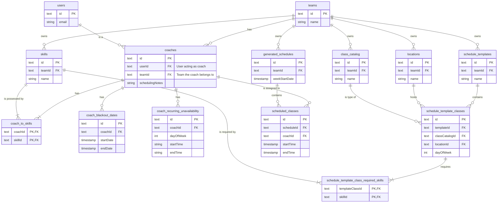

# Task: Implement Gym Scheduler AI

## Commit 1: feat(db): implement initial schema for gym scheduler
**Description:**
This commit lays the database foundation for the Gym Scheduler AI. It introduces a new schema file, `src/db/schemas/scheduling.ts`, to house all scheduler-related tables. It uses a `coaches` table to scope coach-specific settings to a team and supports a hybrid model for unavailability: structured rules for hard constraints and a text field for soft preferences.

- **Files to be created/modified:**
  - `src/db/schemas/scheduling.ts` (new file)
  - `src/db/schema.ts` (exports the new `scheduling` schema)

---
### **Detailed Schema Design (Hybrid Approach)**

#### **1. New Table: `coaches`**
This table is central to identifying and configuring coaches within a specific team.
- **Table Name**: `coaches`
- **Columns**:
  - `id`: `text("id").primaryKey()`
  - `userId`: `text("user_id").notNull().references(() => userTable.id)`
  - `teamId`: `text("team_id").notNull().references(() => teamTable.id)`
  - `weeklyClassLimit`: `integer("weekly_class_limit")`
  - `schedulingPreference`: `text("scheduling_preference", { enum: ["morning", "afternoon", "night", "any"] })`
  - `schedulingNotes`: `text("scheduling_notes")` - For soft, unstructured preferences for the LLM.
  - `isActive`: `integer("is_active").default(1).notNull()`
- **Indexes**: A composite unique index on `(userId, teamId)` is required.

#### **2. New Tables in `src/db/schemas/scheduling.ts`**

**Gym Configuration Tables**
- **`locations`**: Defines physical locations within a gym.
- **`class_catalog`**: A catalog of all offered class types.
- **`skills`**: Certifications required to teach classes.

**Coach & Schedule Constraint Tables**
- **`coach_to_skills`** (Junction): Links `coaches` to `skills`.
- **`coach_blackout_dates`**: Stores specific, one-off dates when a coach is unavailable.
- **`coach_recurring_unavailability`**: Stores recurring, weekly unavailability (hard constraints).

**Scheduling & Template Tables**
- **`schedule_templates`**: Stores master weekly schedule templates.
- **`schedule_template_classes`**: A single class slot within a `schedule_template`.
- **`schedule_template_class_required_skills`** (Junction): Links template classes to required `skills`.

**Generated Schedule Tables**
- **`generated_schedules`**: A finalized, AI-generated schedule for a specific week.
- **`scheduled_classes`**: A single class instance within a `generated_schedule`.

#### **3. Gym Configuration Tables Breakdown**

*   **`locations`**: Defines the distinct physical locations within a gym where classes can be held.
    *   **Columns**:
        *   `id`: `text("id").primaryKey()`
        *   `teamId`: `text("team_id").notNull().references(() => teamTable.id)`
        *   `name`: `text("name").notNull()`

*   **`class_catalog`**: A catalog of all class types offered by the gym.
    *   **Columns**:
        *   `id`: `text("id").primaryKey()`
        *   `teamId`: `text("team_id").notNull().references(() => teamTable.id)`
        *   `name`: `text("name").notNull()`
        *   `description`: `text("description")`

*   **`skills`**: A list of skills or certifications required to teach certain classes.
    *   **Columns**:
        *   `id`: `text("id").primaryKey()`
        *   `teamId`: `text("team_id").notNull().references(() => teamTable.id)`
        *   `name`: `text("name").notNull()`

#### **4. Schedule Template Tables Breakdown**

*   **`schedule_templates`**: The top-level container for a weekly layout.
    *   **Columns**: `id`, `teamId`, `name` (e.g., "Summer 2025 Schedule").

*   **`schedule_template_classes`**: Defines every single recurring class slot in a template.
    *   **Purpose**: Specifies the "what, where, and when" for every class.
    *   **Columns**: `id`, `templateId` (links to `schedule_templates`), `classCatalogId` (what class it is), `locationId` (where it is), `dayOfWeek`, `startTime`, `endTime`, `requiredCoaches`.

*   **`schedule_template_class_required_skills`**: A junction table attaching skill requirements to a class slot.
    *   **Purpose**: To define what qualifications are needed for a specific class slot (e.g., the Monday 9am CrossFit class requires "CrossFit Level 1" AND "CPR Certified").
    *   **Columns**: `templateClassId` (links to a slot in `schedule_template_classes`), `skillId` (links to a `skills` entry).

#### **5. Generated Schedule Tables Breakdown**

*   **`generated_schedules`**: Represents a finalized, AI-generated schedule for a specific week. It acts as a container for all the individual classes scheduled for that week.
    *   **Columns**:
        *   `id`: `text("id").primaryKey()`
        *   `teamId`: `text("team_id").notNull().references(() => teamTable.id)`
        *   `weekStartDate`: `integer("week_start_date", { mode: "timestamp" }).notNull()`

*   **`scheduled_classes`**: Represents a single, specific class instance within a generated schedule, with a coach assigned to it.
    *   **Columns**:
        *   `id`: `text("id").primaryKey()`
        *   `scheduleId`: `text("schedule_id").notNull().references(() => generatedSchedulesTable.id)`
        *   `coachId`: `text("coach_id").references(() => coachesTable.id)` - **Nullable** to allow for unassigned classes.
        *   `classCatalogId`: `text("class_catalog_id").notNull().references(() => classCatalogTable.id)`
        *   `locationId`: `text("location_id").notNull().references(() => locationsTable.id)`
        *   `startTime`: `integer("start_time", { mode: "timestamp" }).notNull()`
        *   `endTime`: `integer("end_time", { mode: "timestamp" }).notNull()`

#### **6. Relationship Diagram**

---

**Verification:**
1.  **Migration Generation:**
    *   **Command:** `pnpm drizzle-kit generate:sqlite`
    *   **Expected Outcome:** A new SQL migration file is successfully created with the correct `CREATE TABLE` statements.
2.  **Migration Application:**
    *   **Command:** `pnpm db:push`
    *   **Expected Outcome:** The migration applies cleanly to the database.

---

## Commit 2: feat(gym-setup): implement API for gym configuration
**Description:**
This commit builds the API endpoints for managing the core gym setup entities: Locations, Class Catalog, and Skills.

- **Files to be created/modified:**
  - `src/actions/gym-setup-actions.ts`
  - `src/app/api/gym/locations/[[...id]]/route.ts` (and similar for classes/skills)

**Verification:**
1.  **Automated Test(s):**
    *   **Command:** `pnpm test --filter gym-setup-actions.test.ts`
    *   **Expected Outcome:** Unit tests assert that all CRUD operations for locations, class catalog, and skills function correctly.

---

## Commit 3: feat(coaches): implement coach profile and constraint management API
**Description:**
This commit adds the API functionality to manage coaches within a team. This includes creating/updating `coaches` entries and managing their associated skills, blackout dates, and recurring unavailability rules.

- **Files to be created/modified:**
  - `src/actions/coach-actions.ts`
  - `src/app/api/teams/[teamId]/coaches/[[...coachId]]/route.ts`

**Verification:**
1.  **Automated Test(s):**
    *   **Command:** `pnpm test --filter coach-actions.test.ts`
    *   **Expected Outcome:** Unit tests verify that a user can be designated as a coach, and all their settings (limits, preferences, notes, blackouts, recurring rules) can be managed correctly.

---

## Commit 4: feat(schedule-templates): implement schedule template creation and management API
**Description:**
This commit implements the API for creating and managing weekly schedule templates.

- **Files to be created/modified:**
  - `src/actions/schedule-template-actions.ts`
  - `src/app/api/schedules/templates/[[...id]]/route.ts`

**Verification:**
1.  **Automated Test(s):**
    *   **Command:** `pnpm test --filter schedule-template-actions.test.ts`
    *   **Expected Outcome:** Tests verify the creation, modification, and deletion of schedule templates.

---

## Commit 5: feat(ai-engine): implement core AI scheduling logic
**Description:**
This commit develops the core AI scheduling engine. It will process all hard constraints (skills, blackouts, recurring unavailability) first, then use an LLM to optimize assignments based on soft preferences.

- **Files to be created/modified:**
  - `src/server/ai/scheduler.ts`
  - `src/actions/ai-actions.ts`

**Verification:**
1.  **Automated Test(s):**
    *   **Command:** `pnpm test --filter scheduler.integration.test.ts`
    *   **Expected Outcome:** An integration test asserts that the generated schedule is 100% conflict-free and respects all hard constraints.

---

## Commit 6: feat(ui): build calendar view and manual override UI
**Description:**
This commit implements the front-end components for viewing and managing the generated schedule.

- **Files to be created/modified:**
  - `src/app/(dashboard)/schedule/page.tsx`
  - `src/components/schedule-calendar.tsx`
  - `src/components/manual-override-modal.tsx`

**Verification:**
1.  **Automated Test(s):**
    *   **Command:** `pnpm test:component --filter schedule-calendar.test.tsx`
    *   **Expected Outcome:** Component tests verify the calendar renders the schedule payload correctly.